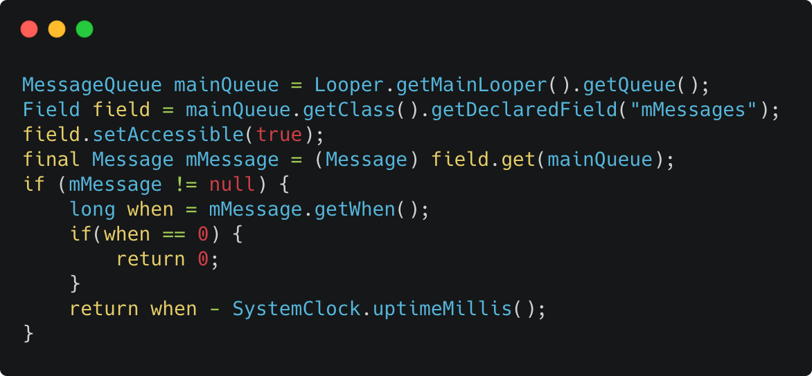
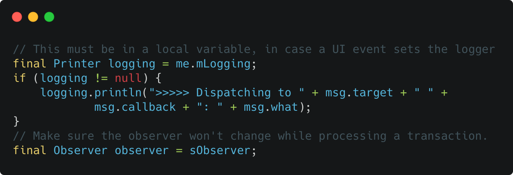

- 简单看了一下 Input Event ANR 检测
- 先说一下事件传递的大致流程，用户按下屏幕后，通过硬件驱动发送给 InputReader
- 然后 InputDispatcher 通过 InputManagerService 获取到触摸事件，最后 InputDispatcher 再把事件传递给具体的 Window，Window 就是具体应用的一个窗口，大概就是这么个流程
- ANR 检测主要发生在 InputDispatcher 给 Window 传递消息的过程
- InputDispatcher 中维护 3 个 Queue 
  - 1.InboundQueue：缓存从 InputReader 发送过来的事件 
  - 2.OutboundQueue：缓存即将发送给 Window 的事件 
  - 3.WaitQueue：缓存已发给 Window 的但还未处理的事件
- 然后 InputDispatcher 内部不断的从 InboundQueue 读取事件，拿到当前焦点 Window 后放入 OutboundQueue 
- 分发给 Window 后再放入 WaitQueue 
- 然后检测 ANR 的条件是在 checkWindowReadyForMoreInputLocked 中
- 常见的 ANR 发生原因主要是
  - 1.事件在 InboundQueue 中等待超过一定时间
  - 2.事件在 WaitQueue 中缓存个数过多
- 发生 ANR 以后，可以通过 adb shell dumpsys input 查看当前 ANR 时事件的状态
```
Input Dispatcher State at time of last ANR:
  ANR:
    Time: 2020-09-15 16:18:45
    Window: Window{ANR 发生的 Window 包名}
    DispatchLatency: 9552.0ms
    WaitDuration: 5005.3ms
    Reason: Waiting to send non-key event because the touched window has not finished processing certain input events that were delivered to it over 500.0ms ago.  Wait queue length: 2.  Wait queue head age: 10907.0ms. // ANR 原因
 Display: 0
    Windows:
      0: name='Window{dfb69bd u0 ScreenDecorOverlayBottom}', displayId=0, portalToDisplayId=-1, paused=false, hasFocus=false, hasWallpaper=false, visible=true, canReceiveKeys=false, flags=0x20800128, type=0x000007e8, layer=0, frame=[0,2897][1440,3120], globalScale=1.000000, windowScale=(1.000000,1.000000), touchableRegion=<empty>, inputFeatures=0x00000000, ownerPid=2392, ownerUid=10055, dispatchingTimeout=5000.000ms
      1: name='Window{e4ea326 u0 ScreenDecorOverlay}', displayId=0, portalToDisplayId=-1, paused=false, hasFocus=false, hasWallpaper=false, visible=true, canReceiveKeys=false, flags=0x20800128, type=0x000007e8, layer=0, frame=[0,0][1440,223], globalScale=1.000000, windowScale=(1.000000,1.000000), touchableRegion=<empty>, inputFeatures=0x00000000, ownerPid=2392, ownerUid=10055, dispatchingTimeout=5000.000ms
      2: name='Window{c869eab u0 GestureButtonRegion}', displayId=0, portalToDisplayId=-1, paused=false, hasFocus=false, hasWallpaper=false, visible=true, canReceiveKeys=false, flags=0x01000118, type=0x000007eb, layer=0, frame=[0,0][1440,3064], globalScale=1.000000, windowScale=(1.000000,1.000000), touchableRegion=[0,0][1440,3064], inputFeatures=0x00000000, ownerPid=2392, ownerUid=10055, dispatchingTimeout=5000.000ms
      3: name='Window{f0c5a3c u0 NavigationBar0}', displayId=0, portalToDisplayId=-1, paused=false, hasFocus=false, hasWallpaper=false, visible=true, canReceiveKeys=false, flags=0x01840038, type=0x000007e3, layer=0, frame=[0,2952][1440,3120], globalScale=1.000000, windowScale=(1.000000,1.000000), touchableRegion=<empty>, inputFeatures=0x00000000, ownerPid=2392, ownerUid=10055, dispatchingTimeout=5000.000ms
      4: name='Window{d6e0a66 u0 StatusBar}', displayId=0, portalToDisplayId=-1, paused=false, hasFocus=false, hasWallpaper=false, visible=true, canReceiveKeys=false, flags=0x81840048, type=0x000007d0, layer=0, frame=[0,0][1440,128], globalScale=1.000000, windowScale=(1.000000,1.000000), touchableRegion=[0,0][1440,128], inputFeatures=0x00000000, ownerPid=2392, ownerUid=10055, dispatchingTimeout=5000.000ms
// 下面是具体的 ANR 时队列中事件状态
InboundQueue: length=104 
    MotionEvent, age=7708.6ms
    ...
OutboundQueue: <empty>
WaitQueue: <empty>
```

- 2021-07-28 补充：
- Android 里判断 ANR 的几种方式
- 方案1: 不断地向主线程的 MessageQueue 发消息，然后定期检查消息是否被处理，缺点是只能监控 Handler 相关的卡顿，性能低
- 方案2: 监听 SIGQUIT 信号，发生 ANR 时系统会发 SIGQUIT 信号用于 dump 堆栈信息，缺点是可能会误报，需要其他额外的检查，比较复杂
- 方案3: 反射获取 MessageQueue 里的首条 Message，检查一下 Message.when 是否已经小于当前时间
- 
- 方案4: 覆盖 Looper 里的 Printer，Looper 里的 Printer 会在每次循环消息的时候打印日志，缺点是只能监控 Handler 相关的卡顿，性能低
- 