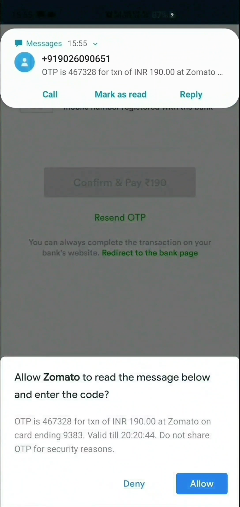
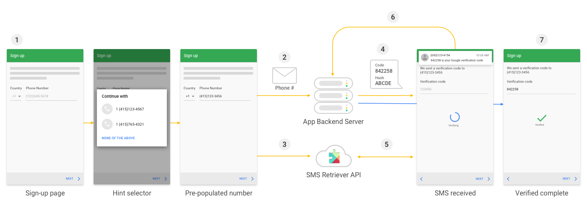

- Android 现在支持自动验证短信验证码，不过得是安装 Google 的手机
- https://developers.google.com/identity/sms-retriever/
- 提供了两种验证方式，
- [SMS User Consent]
- 这种比较简单，在你调用自己服务器的获取验证码以后，调一个 Google Play Service 的接口，等待新的短信
- 如果来了新的短信，就会弹一个系统弹框，提示用户是否允许 App 阅读这条消息，然后 App 再解析这个短信并把验证码填入对应的文本框，可以指定短信号码，不过大部分验证码手机号都是随机的
- 
- 我用别的手机给我的手机发了个验证码，并没有弹出对话框，不知道为什么
- [SMS Retriever]
- 这种稍微复杂点，需要服务器配合，但是用户体验比较好
- 首先还是调用服务器发送验证码，但是这个验证码必须包含一个 11-character 的 hash 串，这个 hash 串不是随便的，必须是由你的 app 包名 + 签名的公匙，再 Sha-256，再 Base64 encode，再取前 11 位。。。
- 然后第二步是调用 Google Play Service 监听短信，如果发现收到了这个 hash 串的短信，Google Play Service 就会直接告诉你短息内容，不需要弹出用户确认的对话框
- 然后你就直接登录或者注册就行，不需要用户确认，更自动化吧
- 