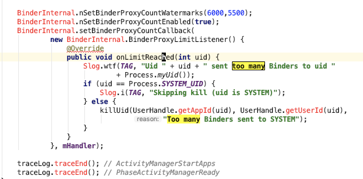

- 之前碰到一个问题，很多小米用户反馈说 App 闪退，但不是一打开就崩溃，一般都是过一会，而且不是所有小米用户，从后台没有找到相应的崩溃日志
- 手头没有小米手机，只好联系用户，帮忙抓取一下手机的运行日志，一般的手机打开开发者模式后在开发者页就可以看到抓取日志的按钮了
- 但是小米比较奇葩，没有这个按钮，网上查了一下，通过在拨号界面输入一串命令
  `*#*#284#*#*`
- 试了一下还真可以，等大概一分钟后就抓取到日志了
- 打开日志文件以后懵逼了，20M 的 Log 文件，也没有通常能看到但那种 Crash 日志，一行行找累死了，快要放弃的时候，突然间看到这么一句日志：
- ````
   ActivityManager: Uid 10406 sent too many Binders to uid 1000
   ActivityManager: Killing 9693:com.xxxx.xxxx/u0a406 (adj 0): Too many Binders sent to SYSTEM
- 那个 `com.xxxx.xxxx` 是应用包名，网上查了一下说 Android P 以后 Android 增加了对 Binder 发送频率的检测，如果频繁发送 Binder 会被系统杀掉
- 
- 上面代码看到一旦超过上限 AMS 就会调用 killUid 把应用杀掉
- 然后再继续搜索，也有同样的人反馈小米 MIUI 10 下崩溃，而且都是国外开发者反馈，有人提示可能因为 Firebase 导致的，Firebase 在没有安装 Google 服务的 MIUI 10 下频繁发送 Binder 导致应用被系统杀掉，唉，不知道算 Google 还是小米的锅