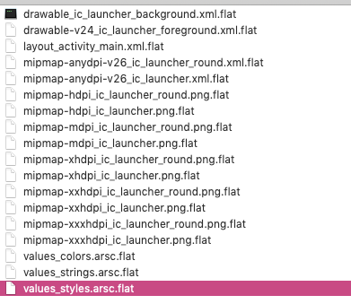

- Android Apk 是一个 zip 包，里面主要包含了两样东西：资源和代码
- 打包资源要用到一个工具：aapt （Android Asset Packaging Tool，新版本是 aapt2）
- 打包代码需要用到 d8 将 java 字节码编译为 Android dex 字节码
- 源码生成字节码的工具是 Java 或 Kotlin 提供，Java 就用 javac，Kotlin 就用 kotlinc
  - 第一步：aapt2 compile --dir 将 res 目录下的所有资源打包成一个 zip 文件，这一步会压缩优化资源文件，注意所有依赖的第三方库所包含的资源也要执行这个操作：
  - 
  - 第二步：aapt2 link ，这一步 aapt2 会将上一步生成的中间文件比如 二进制xml 文件，压缩过的 PNG 文件等打包生成一个 apk 文件，另外还生成 R.java 文件/混淆规则，但是现在这个 apk 只有资源文件，没有代码
  - 第三步：编译源代码，由于源代码是 Kotlin，所以要用 Kotlin 提供的编译工具 kotlinc，将源码 *.kt 编译成 *.class 文件
  - 第四步：将第二部生成的 R.java 编译成 R.class 文件，这里由于是 Java 源码，所以要用 javac 编译
  - 第五步：用 d8 工具将所有的 .class 文件编译生成一个 dex 文件
  - 第六步：zip 工具把这个 dex 文件放进第二步生成的 apk 中
  - 第七步：用 zipalign 对 apk 中的文件进行字节对齐
  - 第八步：用 apksigner 对 apk 签名
这样 Apk 文件就打包完成了，看起来很简单，实际测试的时候有很多坑😄