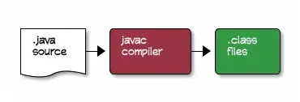
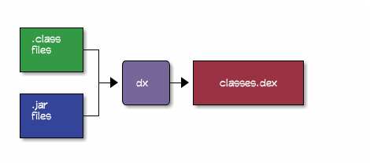
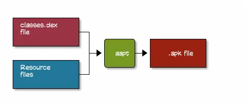
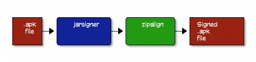
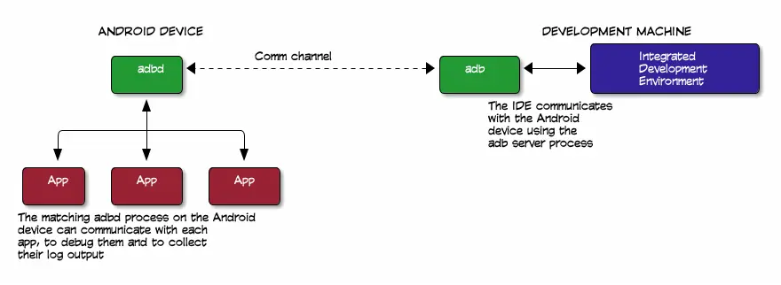
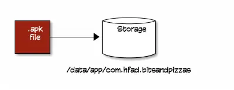

[原文地址](https://github.com/dogriffiths/HeadFirstAndroid/wiki/How-Android-Apps-are-Built-and-Run)
> Android Studio详细的显示了如何编译和运行你的App，但是你是否想知道当你按下Run按钮时，它做了什么？

#### 这里介绍他们是如何编译的

----

##### Java部分

你的代码是Java写的，但是编译是否按照Java的方式呢，一个网页应用呢？

Android应用的编译和Java应用的编译有很大的不同。但开始的时候是一样的：Java源码会经过经过 `javac`命令，被编译为`.class`文件:

转变的代码如下：

     public MainActivity() { 
         super();
         currentPosition = 0;
     }
转换成字节代码如下

    public com.hfad.bitsandpizzas.MainActivity();
      Code:
       0:	aload_0
       1:	invokespecial	#5; //Method android/app/Activity."<init>":()V
       4:	aload_0
       5:	iconst_0
       6:	putfield	#3; //Field currentPosition:I
       9:	return

##### 转换为Dalvik字节代码

`.class`文件包含标准的 *Oracle JVM* Java字节代码，但是Android设备没有使用这种格式的字节代码，而是使用了它自己的独特的自己代码格式*Dalvik*，就像*Oracle JVM*字节代码一样，都是机器代码的一种说明。

这个编译过程需要将`.class`文件和所有的`.jar`库文件转换为一个单独的包含Dalvik字节代码的`classes.dex`文件，用来完成这项任务的是`dx`命令：
`dx`命令将所有的`.class`文件和`.jar`文件缝合成一个`classes.dex`文件。
Dalvik将原始的Java代码转换为如下：

    0x0000: iput-object v1, v0, Lcom/hfad/bitsandpizzas/MainActivity; com.hfad.bitsandpizzas.MainActivity$2.this$0 // field@4869
    0x0002: invoke-direct {v0}, void java.lang.Object.<init>() // method@13682
    0x0005: return-void

##### 将classes.dex和资源打包

`classes.dex`文件和资源文件，如：图片，布局等，将他们压缩进一个 zip文件，叫做安装包，或者.apk文件，完成这项任务的命令叫做 `aapt`。

`.apk`文件就是你需要的应用文件，你可以发布了，但是，或许你需要知道另外一步...

##### 你可能需要将.apk文件签名

如果你要在Google Play商店发布你的应用，你需要给这个应用签名，签名意味着你在`.apk`文件添加了一个独一无二的文件，基于校验`.apk`文件和私有的密匙。
`.apk`文件使用标准的`jarsigner`工具编译，`jarsigner`是用于编辑`.jar`文件的，但对`.apk`文件依然有效，因为他们都是`.zip`格式的文件。
如果你要编译`.apk`文件，你还需要一个叫`zipalign`的工具，用来确保压缩的正确性。

#### 如何部署

----
##### 如果Adb进程没有运行，它会自动启动

将app部署到Android设备的工具是`adb`（Android Debug Bridge)，`adb`在你的开发环境和Android设备上各有一套，如果你的机器上没有运行adb进程，`adb`命令会启动这个进程

`adb`进程将会打开一个网络socket并在5037端口监听命令。
每个你输入的`adb`命令将会在这个端口发送。

##### .apk文件被安装到设备上

`adb`命令用于将`.apk`文件传输到Android文件系统中，位置在/data/app/com.xxx.xxx下，其中com.xxx.xxx就是应用的包名。
