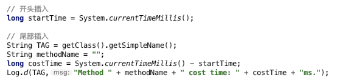
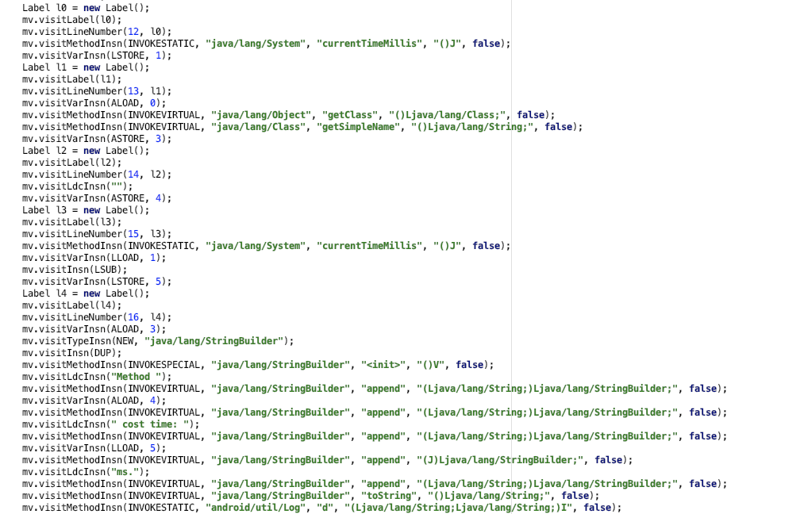

- 终于字节码插桩成功了，最开始使用的编辑字节码框架是 ASM 框架，但是感觉太复杂了，所以在网上找了另外一个框架叫：Javassist，使用非常简单
- 但是由于这个框架好久没人维护了，导致无法在 Android 上无法使用，所以还是硬着头皮继续看 ASM
- 使用过程大概是这样的：
    - 1. 使用 Gradle 插件找到编译后的 .class 类文件
    - 2. 使用 ASM 框架的 ClassReader 读取 .class 文件
    - 3. 使用 ClassVisitor 访问 .class 文件，在它的 visitMethod 中根据 name，descriptor，过滤你想要修改的方法
    - 4. 在 AdviceAdapter 的 onMethodEnter 可以向方法的开头插入代码
    - 5. 在 AdviceAdapter 的 onMethodExit 可以向方法的尾部插入代码
- ASM 框架最复杂的地方是，你往里插入代码也必须是以字节码的方式插入
- 比如我要往方法开头拆入一段代码，方法最后再拆入四行代码
- 
- 使用 ASM 写的话就要写这么多
- 
- 好在有个插件 `ASM Bytecode Outline` 可以帮你把要插入的代码转成 ASM 使用的格式