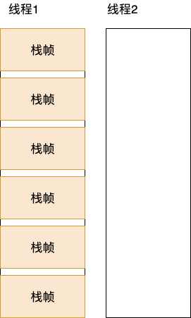

- 大学计算机原理学的计算机 Cpu 指令的执行是基于寄存器的
- 比如计算一个加法：a = b + c，转成指令可能是这样的：`ADD a b c`（三地址指令），把 b c 寄存器的值求和存入 a 寄存器，
- 那计算 b += c 呢？
- 它对应的指令可能是这样的：`ADD b c`（二地址指令），把 b c 求和并存入 b 寄存器中
- 但是在 Java 中，大部分指令都是一地址指令和零地址指令（比如下面那个iadd）：
- ````
    iconst_1     //常量1压入操作数栈
    iconst_2    //常量2压入操作数栈
    iadd           //弹出操作数栈的前两个int并相加（隐式关系），并把计算结果压入栈顶
    istore_0     //弹出栈顶的int，保存到局部变量表的第0个位置
    ````
- Java 之所以能实现这样的指令是因为它的指令集是基于栈
- 像上面的指令其实有一些隐含的关系，比如 iadd 其实就是隐式的计算 iconst_1 和 iconst_2 的和
- 这些指令前面都是 `i` 代表他们都是 int 类型
- 从这感觉 Java 的指令很啰嗦，使用基于寄存器的指令的话，一条指令就完成了，Java 却要 4 条
- Java 栈数据结构是这样的：
- 
- 每个线程都有一个独立的栈，线程之间相互独立，
- 每个栈帧对应一个方法，里面记录了方法的局部变量表，操作数栈，常量池的引用，返回地址等，
- 栈帧随着方法调用创建，随着方法返回销毁
- 但是 Android 却是基于寄存器的，不过这里不是直接操作硬件的寄存器，而是在内存中模拟一组寄存器，通常最多 16 个，但是也可以根据实际情况增加到 256 个
- 由于容器的不同，Android 字节码和 Java 字节码完全不同，Android 的字节码（smali）更多的是二地址指令和三地址指令
- 由于是内存中模拟的寄存器，所以和 Java 类似，它将每个方法调用封装成一个帧，包含了一组寄存器（个数在编译时期已经确定，Java 是一个操作数栈）+ 方法所需的辅助数据（程序计数器，.dex 文件引用？没太明白），相比于传统寄存器的好处是，避免多个进程争夺同一个寄存器造成阻塞等待，不过速度没有传统寄存器快
- 看一下 Android 和 Java 字节码的区别：
- ````
    int a = 1;
    int b = 2;
    int c = a + b;
    ````
- 上面代码对应的 Java 字节码是：
  ````
  0: iconst_1 // 常量1
  1: istore_1 // 存入1的位置
  2: iconst_2 // 常量2
  3: istore_2 // 存入2的位置
  4: iload_1  // 入栈
  5: iload_2  // 入栈
  6: iadd     // 弹出2个并求和并把结果入栈
  7: istore_3 // 存入3的位置
  ````
- 上面代码对应的 Android 字节码是：
- ````
    const/4 v0, 0x1    // 0x1 移到 v0 寄存器中
    const/4 v1, 0x2    // 0x2 移到 v1 寄存器中
    add-int v2, v0, v1 // 计算 v0 和 v1 的和并存入 v2 寄存器中
    ````
- `const/4` 的意思是存入 4 位的寄存器，如果这个数比较大就会用 `const/16`
- 从上面也能看出来 Android 字节码比 Java 少了很多
- Android 的这种设计摒弃了 Java 冗余的操作数栈指令，但又吸纳了虚拟多个指令容器的特点