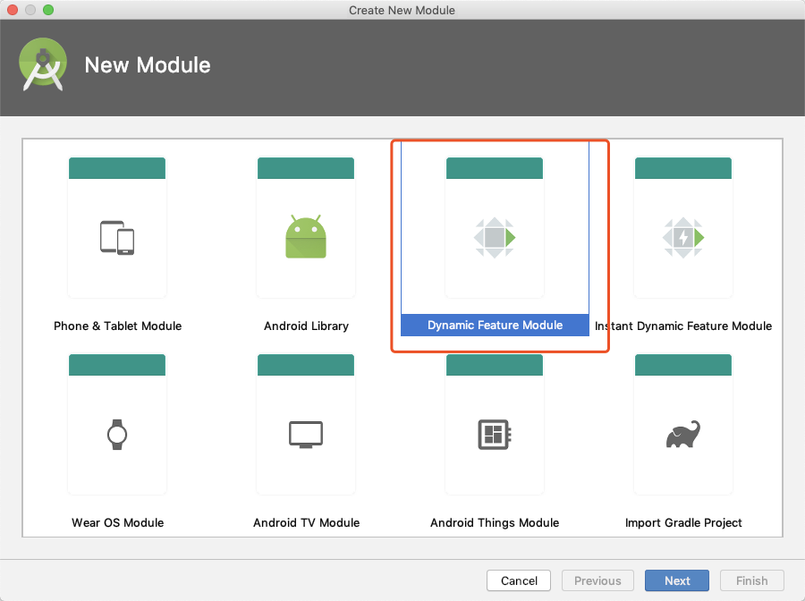
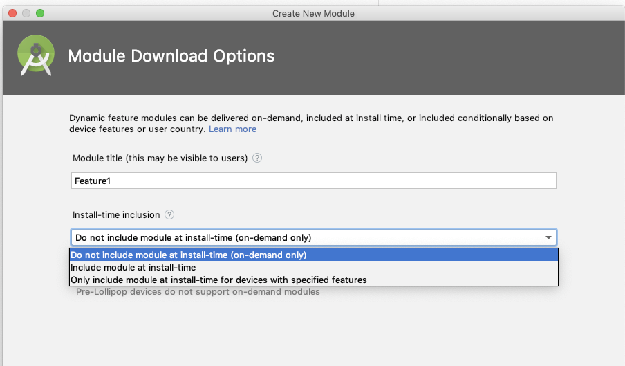
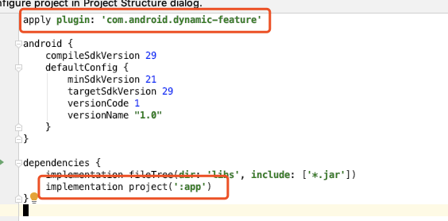
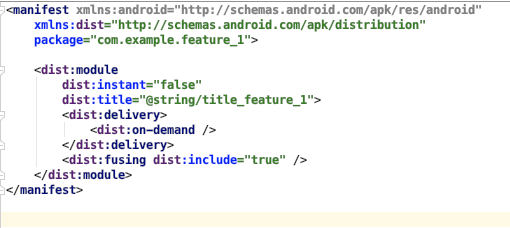

Google 上线一个动态分发机制，就是像积木一样，让用户先下载一个基础 Apk，其他的按需下载。
这种动态分发可以有效的降低 Apk 初始下载的体积。
怎么做呢？

首先，创建一个普通项目，然后再在 Android Studio -> New module -> Dynamic Feature Module，然后填写一些配置就可以了：



生成后的模块和普通模块有什么不同呢？
1. 在 build.gradle 文件中， apply plugin:'com.android.dynamic-feature'
2. 还要依赖主项目
-  
3. 在 Manifest 文件也要如下配置
- 
  那如何编译呢？
  在 AS 中选择 Build -> Build bundle/Apk -> Build Apk，编译完成后会分别在住项目和动态项目的 build 文件夹下生成 apk 文件，然后把这些 apk 开心的传到 GooglePlay 后台就可以啦

什么？你没有 GP 账户？哦，那 Google 开源了一个[测试工具](https://github.com/google/bundletool)，可以测试是否可用。

那如何加载动态模块呢？
为了实现动态下载功能，您需要添加以下依赖：
````
implementation 'com.google.android.play:core:1.3.4'
````
添加完以后在触发下载的地方加如下代码：
````
val splitInstallManager = SplitInstallManagerFactory.create(this)
val request = SplitInstallRequest.newBuilder()
            .addModule("feature_1")
            .build();
splitInstallManager.startInstall(request)
            .addOnSuccessListener {  }
            .addOnFailureListener { 
                
            }
````
官方文档地址：[dynamic-delivery
](https://developer.android.com/studio/projects/dynamic-delivery)

