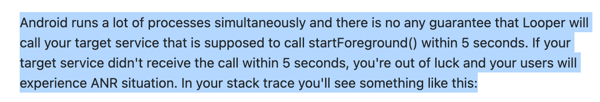

- 从 Android O 开始，开启前台服务后要 5 秒（后面又改成 10 秒）内调用 startForeground，否则会给你把 App 崩溃+ANR
- Crash 报错：`android.app.RemoteServiceException: Context.startForegroundService() did not then call Service.startForeground()`
- 但是后面发现即便加了 startForeground，崩溃统计里还是有这种报错，开始以为是 ANR 了导致虽然开启服务
- 但是卡住了 5 秒内没有调到 `startForeground`，毕竟 Android 设备五花八门，卡到爆的设备也是有的
- 比如这个人也是这么说的
- 
- 但是真的如此吗，今天又看到了这个报错，尝试去网上查了一下，搜到了这个人的回答
- https://stackoverflow.com/a/49418249
- 他的意思是如果你调了 `startForegroundService` 然后在调用 `startForeground` 之前调了 `stopService`
- 就会触发上面的崩溃，也就是说开启前台服务后马上停止服务也会导致崩溃
- 我自己写代码做实验尝试重现了一下，确实如他所说应用会崩溃
- 他们给 Google 提了 issue，但是 Google 的工程师给的反馈是这不是一个 bug，而是调用者自己的错误使用
- 不应该在 `startForeground` 之前调用 `stopService`，但报错提示清晰一点就好了
- 知道问题所在就好解决这个问题了，只要确保 `startForeground` 之后调用 `stopService` 就好了
- 方案1: Service 注册广播，想停止服务就给这个广告发送消息，让 Service 自己关闭自己
- 这个方案的缺点是可能广播还没有注册完成，stopService 的命令已经发了，导致会错过消息
- 方案2: 监听 Service 的 onStartCommand，通过特殊标记通知 Service 关闭自己，但是这种情况如果 Service 没有启动会先把服务打开，有点多余
- 所以还是方案1好点，顶多在极小概率下服务没有被关掉