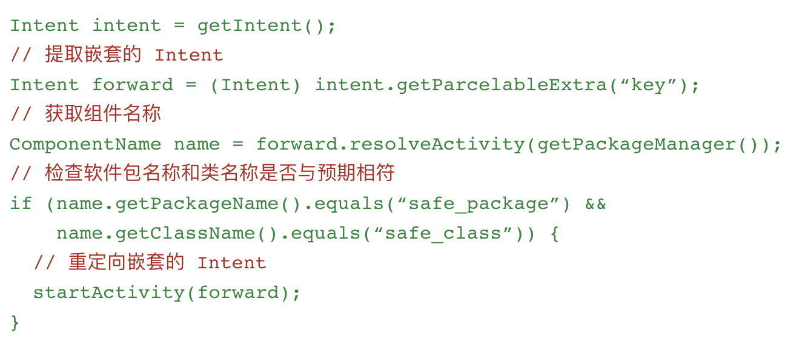

- Intent 主要是负责 Android 各个组件之间的通信，比如 startActivity(Intent)/startService(Intent)/sendBroadcast 等等
- Intent 里会带一些数据/描述等，系统则根据 Intent 的描述找到对应的组件将 Intent 传过去
- 有时候代码里会根据 Intent 里面的内容，跳转到其他页面，或者 setResult 设置一些数据返回，攻击者就可以分析 Apk，利用漏洞窃取数据
  解决方案有 3 种
- android:exported="false"
- 直接禁止其他应用访问该 Activity
    - 
- 确保提取的 Intent 来自可信的来源
    - 