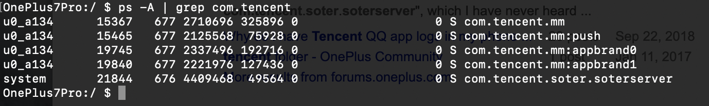

- 应用保活一直让国内的 Android 码农很痛苦，比如闹钟/导航类软件
- 在标准的 Android 系统，把进程的重要性分成几个等级
    - 1. 前台进程，当前最前面显示的 Activity 和 前台服务
    - 2. 可见进程，暂停状态的 Activity
    - 3. 后台服务，Service
    - 4. 剩下的
- 所以你只需将应用声明为前台应用（在通知栏创建一个通知），系统一般就不会清理了
- 如果是定时提醒类软件，甚至不需要什么前台服务，只需告诉 Google 框架 定时将自己唤醒即可
- 但是，我大清自有国情
- 首先，各式各样的自定义 Rom，没有统一的系统服务，推送都有 N 个平台，
- 其次，几乎每个国产系统都喜欢杀进程，什么狗屁前台服务，全部杀掉，为啥呢，怕手机卡，为啥会卡呢，因为国内的软件太流氓，后台不知道在干啥
- 为了避免被系统杀死，流氓就想一些更流氓的招数避免被系统清理
    - 1. 双进程守护，现在已经守护不了了，但是可以降低单个进程的内存，降低被杀的风险
        - 下面是微信的几个进程
        -  
    - 2. 链式唤醒，比如你接了阿里的推送，当用户打开你的软件时，会唤醒其他接入阿里推送的软件
    - 3. 传说还有一像素 Activity，我没想明白怎么实现
    - 4. 今天看到一个最奇葩的是百度导航，它通过播放一个没有声音的音频文件保活，这样系统就以为你在播放音乐，就不会把你 Kill 掉