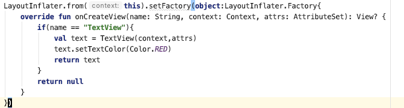
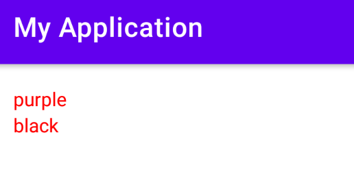
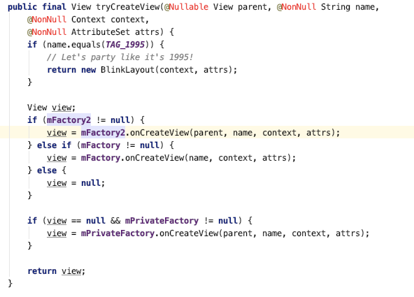

- Android LayoutInflater 是用来将 XML 布局翻译成 View 的，它支持用户自己注入解析器
- 分别是 LayoutInflater.setFactory() 和 LayoutInflater.setFactory2()
- 有什么用呢？可以拦截 View 的创建，做一些修改，比如下面这样
- 这个布局默认有两个 TextView，颜色分别是紫色和黑色
- 
- 自定义一个 Factory，将 TextView 颜色修改为红色：
- 
- 需要注意的是 `android.widget` 包下的 View ，回调中的 name 只有 class name，其他 View 还包含包名
- 
- Factory2 的回调里包含了 parent，优先级比 Factory 高，其他没啥区别
- 
