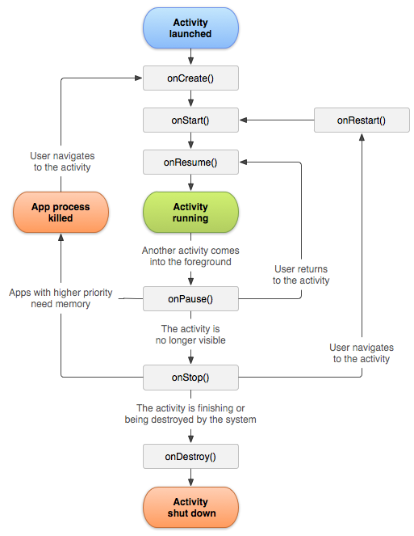
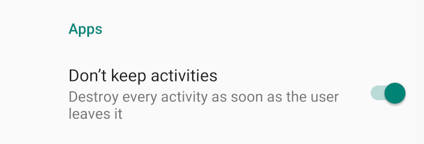

在 Activity 的 `onActivityResult` 方法中执行 `FragmentManager.commit()` 有时候会报下面这个错误：
- `Caused by java.lang.IllegalStateException: Can not perform this action after onSaveInstanceState`
  看了一下最终错误的位置在：`FragmentManagerImpl` 的 `checkStateLoss()` 方法：
````
private void checkStateLoss() {
    if (isStateSaved()) {
        throw new IllegalStateException(
            "Can not perform this action after onSaveInstanceState");
    }
}

@Override
public boolean isStateSaved() {
    // See saveAllState() for the explanation of this.  We do this for
    // all platform versions, to keep our behavior more consistent between
    // them.
    return mStateSaved || mStopped;
}
````
判断是否 `isStateSaved` 条件是 `mStateSaved || mStopped`，简单的看了一下，`mStopped` 在 Activity 的 `onStop()` 执行后被置为 `true`，其他生命周期置为 `false`，而 `mStateSaved` 是在 Activity 的 `onSaveInstanceState()` 方法执行后置为 `true`，那下面这四个事件的先后关系是？
- `onActivityResult`
- `onStop`
- `onStart`
- `onSaveInstanceState`

看了一下官方的 Activity 生命周期图：



标准的生命周期里没有 `onActivityResult` 和 `onSaveInstanceState` 这两个事件，那我们做个实验试一下。

从 A 调用 startActivityForResult 跳到 B，再从 B 返回 A 的这个过程中 A 的生命周期如下（在 Android 23 的模拟器上 `onStop` 在 `onSaveInstanceState` 之后）：
````
D/MainActivity: ---> onStop
D/MainActivity: ---> onSaveInstanceState
D/MainActivity: ---> onActivityResult
D/MainActivity: ---> onStart
````
上面👆可以看出，在 `onActivityResult` 执行时，`onStart` 还没有执行，此时：`mStopped is false` ，所以当执行 `commit` 时会抛出异常，So，不要在 `onActivityResult` 里执行 `FragmentManager .commit()` 操作。

还有一个解决办法，使用 `commitAllowingStateLoss()` 替换 `commit()` 方法，这个方法不会检测 Activity 状态，但是不建议这么做，因为 `onSaveInstanceState` 之后的操作都不会被 `Bundle` 记录，在 `onRestoreInstanceState` 恢复时会丢弃这些操作可能导致显示错误的UI。

其他关于 SaveInstance 的一些知识

- Android 在 `Activity` 的 `onPause` 和 `onStop` 之间或之后调用 `onSaveInstanceState`，让用户将一些状态信息保存到 Bundle 里，当内存不足被回收后下次开启 Activity 还能恢复之前当状态，其实除了用户处理的信息，Android 系统也会帮我们缓存一些状态，系统缓存的信息大概有：
  -  View 树中每个 View 的状态信息
  - 不同的子 Activity 会多缓存一些跟自己特性相关的信息，如 AppCompatActivity 会记录当前主题，FragmentActivity 会缓存和 Fragment 相关的一些信息

- 通知 View 树保存信息的过程和 View 的绘制/事件的传递过程类似，如果是 ViewGroup 要通知子 View 继续保存，如果是 View 则只保存自己的信息

- 那具体保存哪些信息呢，这个根据具体 View 展示内容的不同而不同，具体缓存内容在 View 的内部类 SavedState 中
- 比如 TextView 会缓存：
  - 光标开始/结束位置
  - TextView 文字内容
  - frozenWithFocus
  - 错误信息
  - Editor 等

另外 View 必须指定 ID 才能别系统自动缓存信息，因为系统需要 View 的 ID 作为缓存的 Key，所以如果想被自动缓存，一定要指定 View 的 ID

测试触发保存和恢复只需要在开发者模式中打开：


