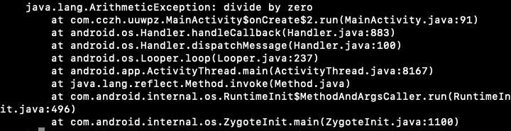

- 经过 R8 编译混淆过后的代码，为了压缩体积行号表丢掉了，但是这导致根据报错的堆栈信息无法定位到错误的具体行号，提升了修 bug 的难度
- 
- 可以在 proguard 文件指定让它保留 LineNumberTable
- 
- 保留之后 retrace 堆栈信息就能定位到具体的行号，方便准确的定位报错位置
- 
- 如果不保留 retrace 就是这样的
- 
- 但这样打出的堆栈信息里会有抛异常的文件名，暴露代码所在文件
- 
- 所以需要通过 renamesourcefileattribute SourceFile 将抛出堆栈是的原文件名字改成 SourceFile
- 