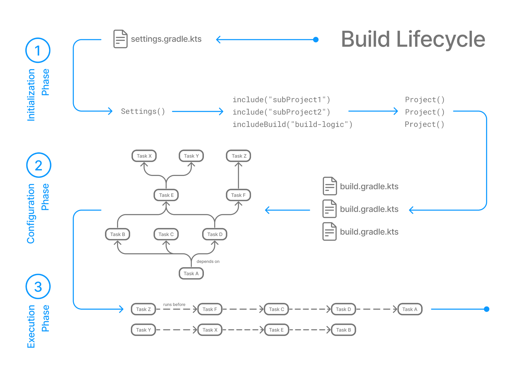

- Gradle 是一套自动化工具，Android 依赖管理，编译，打包，测试等流程就是使用的 Gradle
- 它通过 DSL 编写的自动化脚本去进行编译，
- 其核心是
- 1.Project - 每个项目对应一个 build.gradle，支持多项目，子项目等
- 2.Task - Task 是 Gradle 的最小单位，代表一个具体的任务
- 3.Plugin - 可以通过插件扩展其功
- Gradle 就是的编译过程就是依赖了很多个 Task 进行的，
- 比如执行 `gradle clean` 就是执行的 'clean' task，编译 `gradle assemble[flavor][Debug/Release]` 等
- 然后它又提供了非常多的钩子，你可以在几乎任意时刻插入自己的逻辑
- 这是在官网找的它的生命周期演示图
- 
- 我想要做的是修改它的编译流程，替换成我自己定义的远程编译，所有需要定制几个 Task
- 首先定义几个 Task
```
def upload = tasks.create('uploadToRemote', Exec) {}
def execute = tasks.create('executeOnRemote', Exec) {}
def download = tasks.create('downloadFromRemote', Exec) {}
```
- 分别是：上传代码到远端，在远端执行，下载到本地
- 但是这三个任务是有先后顺序的，所有这是：
```
execute.mustRunAfter(upload)
download.mustRunAfter(execute)
```
- 然后还要确保只有前面的任务成功了才能继续执行后面的任务，否则就停止，所以设置
```
execute.onlyIf { upload.executionResult.orNull?.exitValue == 0 }
download.onlyIf { execute.executionResult.orNull?.exitValue == 0 }
```
- 然后在设置一个任务依赖这三个任务，因为是远程打包，就叫 `remoteBuild` 把
```
def remoteBuild = tasks.create("remoteBuild").dependsOn(upload, execute, download)
```
- Android Studio Run 的时候有个 assemble 的默认打包任务，我们不希望它执行，只执行我们自己定义的这些 Task
- 设置也很简单，只需要在 root project 的 build.gradle 里设置成我们自己的 Task 即可
```
gradle.startParameter.setTaskNames(['remoteBuild'])
```
- 这样在点击 Android Studio 的 Run 时 Gradle 就会执行我们自己的任务
- 这个是传统本地编译的耗时
- 
- 这是远程编译耗时
- 
- 可以看到编译速度快了很多
- 这个是我在本机编译的时候 CPU 占用，打个字都卡的不行
- 
- 这个是远程编译的时候 CPU 占用
- 