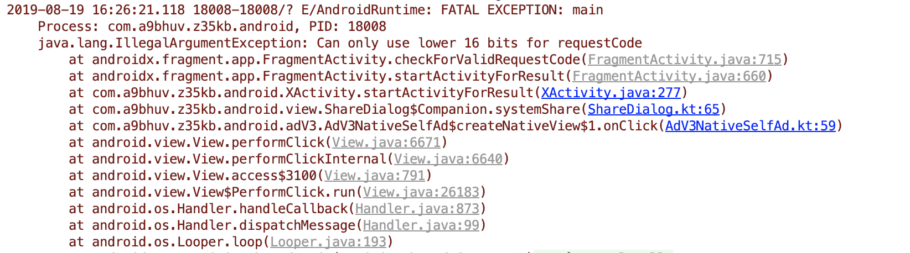
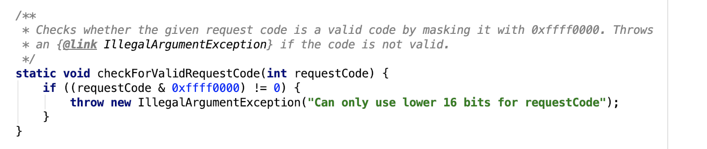

- 在写一个页面跳转要的一个 REQUEST_CODE 时候写了一个比较大的数字，运行后应用直接崩溃了
- 
- 提示只能写低 16 位的数字，然后看了一下源码里面的限制：
- 
- 那具体范围的多少呢，巴拉巴拉算了半天 2^16 = 65536，不过 65536 的 16 进制是 0x10000，所以要减去1 = [0,65535]
- 刚算晚反应过来，直接写成 16 进制不就行了：[0x0000,0xFFFF]
- 那为什么要加这个限制呢，因为高 16 位有其他的用途，Android 里有很多这种把一个 int 拆成两半的用法，真是勤俭持家