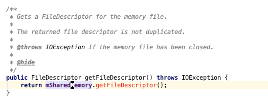
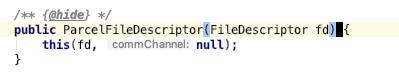
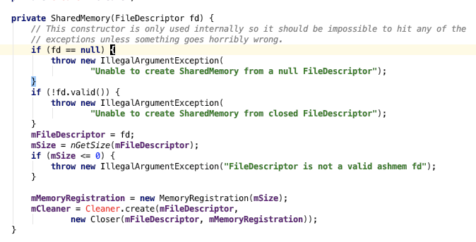

Android 有一个 MemoryFile 类，可以用来进程间共享内存，但是对一般的 App 限制使用



比如获取文件描述符这个方法是隐藏的，必须反射访问
拿到这个 FileDescriptor 还不能直接发送给其他进程，因为没法序列化（嗯），但是可以
包装成 ParcelFileDescriptor 传递，这个方法任然是 @hide 隐藏的，所以还是要通过反射创建



拿到这个 fd 以后发送给接收方，接收方得想办法构造一个 MemoryFile 出来访问这部分数据
我看网上有一种办法是，对面在创建一个 MemoryFile 然后马上 close 调用，再调用 native_mmap 这个方法将 MemoryFile 指向那个 FileDescriptor，但是最新版本的代码里这个方法已经被删掉了
但是新版本多了一个叫 SharedMemory 的类，现在的 MemoryFile 基本上就是对 SharedMemory 的封装
然后这个 SharedMemory 也有一个隐藏的构造方法：



通过这个类就可以愉快的读取数据了

上次分享 Android 匿名共享内存的时候 file descriptor 跨进程传递的问题没搞清楚
背景介绍：
首先，linux 系统中 fd 是一个正整数，每个进程都自己维护一套 fd 表，不同进程 fd 是独立的
然后进程的 fd 表中存储着指向 inode 的指针
inode 是一种数据结构，每个文件都有一个对应的 inode，它里面存储了：权限，文件大小，创建时间，修改时间，metadata，存储地址等
所以每次读取或者写入文件实际都是通过 inode 获取文件实际地址的，这个 inode 是存放在硬盘的一个特殊区域，可以跨进程
然后回到匿名共享内存
进程 A 从内存中开辟一块共享内存并返回 fd，其实是把一个特殊的虚拟驱动器映射到内存中
进程 A 通过 Binder 把这个 fd 发送给进程 B，这里的 Binder 是一个 type 为 BINDER_TYPE_FD 的 Binder，这个类型的 Binder 在 binder_transaction 时会做有些特殊处理
````
// 先根据当前进程 A 的 fd 获取打开文件结构体
fp = (struct flat_binder_object *)(t->buffer->data + *offp);
file = fget(fp->handle);
// target_proc 是目标进程
// 获取进程 B 中一个空的 fd
target_fd = task_get_unused_fd_flags(target_proc, O_CLOEXEC);
// 把进程 B 的空的 fd 和这个 file 关联起来
task_fd_install(target_proc, target_fd, file);
// 重新赋值一下 Binder 的 handle
fp->handle = target_fd;
````
这样进程 B 在接受到 Binder 消息时从 handle 取出来的 fd 就已经是 target_fd 了
两个进程的不同 fd 其实指向的是同一个文件
