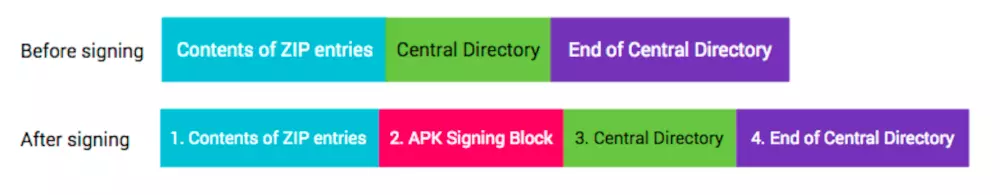

首先，用户自己生成一个签名文件，签名文件包含一个私匙和一个公匙，
签名过程：
1.  计算 Apk 中每个文件的摘要，摘要算法一般使用 SHA1 + Base64
    1.1 生成的摘存在 MANIFEST.MF 和 CERT.SF 中，其中 CERT.SF 中多了 MANIFEST.MF 文件的摘要，另外 MANIFEST.MF 的其他条目进行二次摘要（Double Check?）
2. 用签名文件中的私匙给摘要加密，加密后的信息就是签名信息
3. 将签名信息写入CERT.RSA，并将 CERT.RSA（公匙+签名信息），MANIFEST.MF，CERT.SF 文件写入 Apk 的 META-INF 文件夹中

校验过程：
1. 生成 Apk 中每个文件的摘要
2. 使用 CERT.RSA 的公匙对数字签名进行解密，解出之前签名时的摘要信息
3. 比较两个摘要信息是否一致

后来 Android 7.0 之后 Google 搞了另外一套签名方法 V2，之所以这样是因为 V1 有些问题：
1. 要对每个文件生成摘要，如果文件过多会导致速度很慢
2. META-INF 文件夹由于存放摘要信息，无法被签名，所以修改这个文件夹中的文件系统无法识别

V2 是按照数据块计算摘要的，将 apk 分成 1M 的块，计算每块的摘要，而签名信息是存在下面这个位置：

V2 计算摘要的算法比较复杂，SHA2-256 SHA2-512 轮番上阵