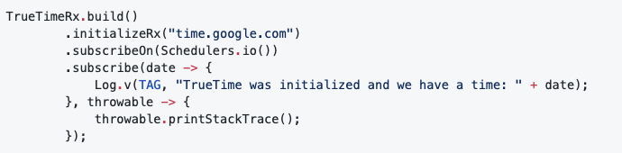

- 分享一个获取当前准确时间的库 TrueTime，一般 Android 设备如果用户修改了系统时间，那么 App 获取到的时间也变了
- 这样有可能造成一些漏洞，比如 App 7 天内免广告，用户可以一直把时间改到 7 天内之类的
- 然后这个库是通过授时中心通过 SNTP 协议获取当前时间，再累加上当前设备的开机时候，算出一个相对准确的时间
- 使用的时候可以指定从哪个授时服务获取时间，比如：time.google.com, time.apple.com 等
- App 启动的时候拉取一下时间，后面就不需要网络通信了
- 
- 后面要获取当前时间只需要 TrueTime.now();