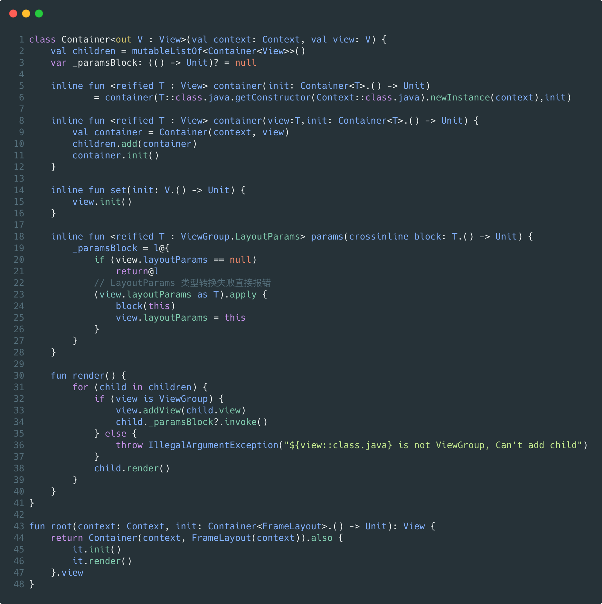
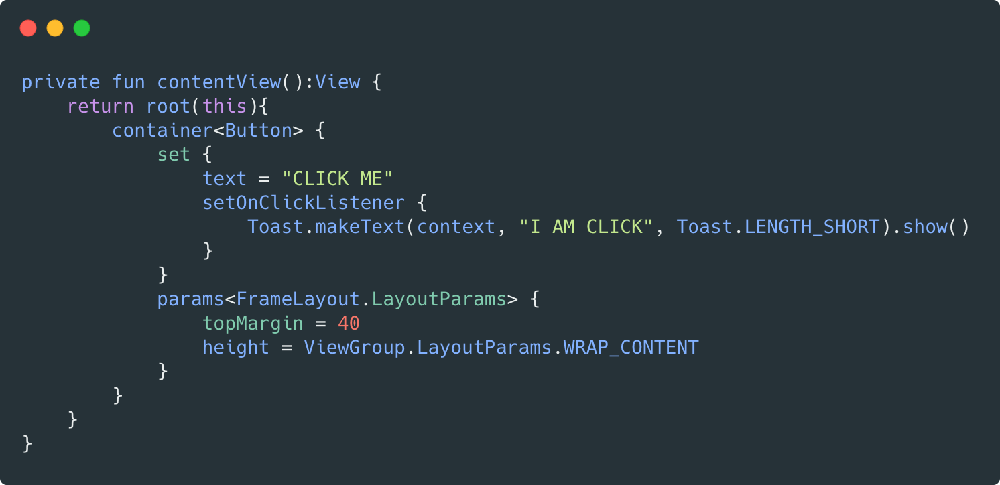
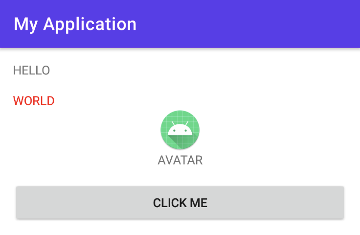

- 一种简单的 Android View DSL 的方案，不到 50 行代码，消耗不少头发
- 
- 调用的时候就像下面这样，用的是现成的 View，兼容性没啥问题
- 用 kotlin 的内联和 reified 机制将泛型反射成一个对象，所以 View 就自动创建好了
- 不过默认调用的是只传 context 的构造方法，所以也提供了自己 new View 传进去的接口
- 
- 简单的试了一下没啥大问题
- 