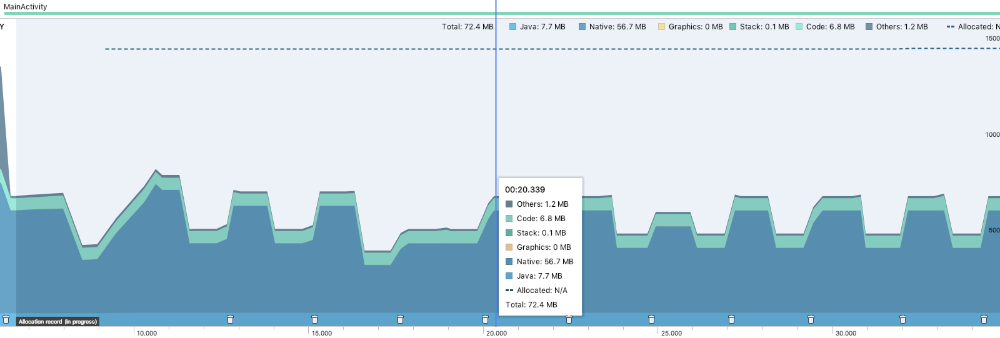
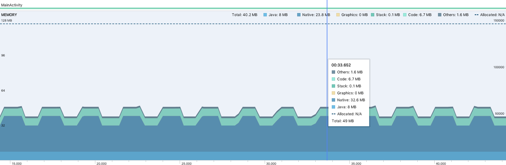

将图片转换为 Bitmap 的过程中，一般使用 BitmapFactory.decodeXXX()，在一些需要大量 decode 的情况会频繁触发 GC 导致应用卡顿，例如图片列表快速滑动
Android 提供了一个方法可以复用废弃但还没有被回收的 Bitmap 占用的内存，具体用法是：

```
val bitmapOption = BitmapFactory.Options()
bitmapOption.inMutable = true // 标记为易变的
bitmapOption.inBitmap = recycleBitmap // 指定要占用哪个废弃的 Bitmap 内存
bitmap = BitmapFactory.decodeResource(resources, R.drawable.image_1, bitmapOption)
```
实测效果如下：


未使用复用对情况频繁触发 GC，开启后不会触发 GC，注意，复用对两个 Bitmap 所占内存大小必须一样或小于原来的 Bitmap

补充一下：是否可以复用 Bitmap 判断条件

````
private fun getBytesPerPixel(config: Bitmap.Config?): Int {
    var config = config
    if (config == null) {
        config = Bitmap.Config.ARGB_8888
    }

    val bytesPerPixel: Int
    when (config) {
        Bitmap.Config.ALPHA_8 -> bytesPerPixel = 1
        Bitmap.Config.RGB_565, Bitmap.Config.ARGB_4444 -> bytesPerPixel = 2
        Bitmap.Config.ARGB_8888 -> bytesPerPixel = 4
        else -> bytesPerPixel = 4
    }
    return bytesPerPixel
}

fun canUseForInBitmap(
        candidate: Bitmap, targetOptions: BitmapFactory.Options): Boolean {
    if (Build.VERSION.SDK_INT >= Build.VERSION_CODES.KITKAT) {
        // From Android 4.4 (KitKat) onward we can re-use if the byte size of
        // the new bitmap is smaller than the reusable bitmap candidate
        // allocation byte count.
        val width = targetOptions.outWidth / targetOptions.inSampleSize
        val height = targetOptions.outHeight / targetOptions.inSampleSize
        val byteCount = width * height * getBytesPerPixel(candidate.config)

        try {
            return byteCount <= candidate.allocationByteCount
        } catch (e: NullPointerException) {
            return byteCount <= candidate.height * candidate.rowBytes
        }

    }
    // On earlier versions, the dimensions must match exactly and the inSampleSize must be 1
    return (candidate.width == targetOptions.outWidth
            && candidate.height == targetOptions.outHeight
            && targetOptions.inSampleSize == 1)
}
````