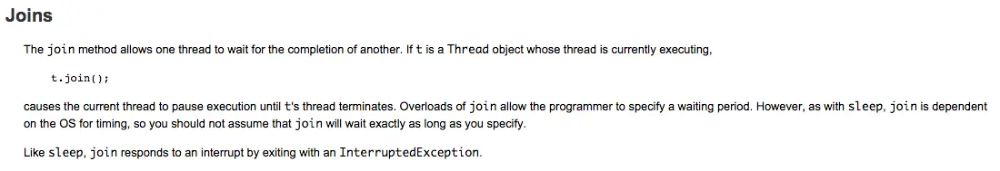

在上一篇搞懂了什么事SurfaceView，这一节，就要学习怎么使用SurfaceView

    class OurView extends SurfaceView implements Runnable {
         public OurView(Context context){
              super(context);
         }
         public void run(){
            //write some code
         }
    }

上面是一个最小的自定义SurfaceView的例子，可以看到，首先继承SurfaceView和Runnable接口，其次要实现一个带Context的构造方法（这一点跟自定义普通的View是一致的），然后是实现Runnable接口的run方法，就这样，一个最简单的自定义SurfaceView就完成了。

那怎么将这个SurfaceView加载到Activity中呢？其实用法和普通的View一样，稍微有一点点区别在于，在Activity或者Fragment的方法中，你需要重写onPause()和onResume()方法，并在onPause()中，停止Surface的绘制，在onResume()中，启动绘制。

我们上面定义的OurView即是一个View，同时也是一个Runnable接口，所以需要有一个Thread去运行它，为了方便，我们在OurView中添加两个方法

    class OurView extends SurfaceView implements Runnable {
        Thread thread;
        boolean isRunning;
        ...

        public void run(){
            while(isRunning){
                //do something
            }
        }
        public void pause(){
            isRunning = false;
            while(true){    
                try{        
                     thread.join();    
                } catch (InterruptedException e) {                                                   
                     e.printStackTrace();   
                }    
                break;
             }            
             thread = null;
        }
        public void resume(){
            isRunning = true;
            thread = new Thread(this);
            thread.start();
        }
        ...
    }
在resume()方法中，启动一个新线程并执行start()方法，此时，OurView中的run()方法会在Thread线程运行（非主线程）

在pause()方法中，调用Thread.join()方法，这个方法是什么意思呢？继续查找官方文档。

从官方文档的意思可以得知，Thread.join()的意思是，让调用该方法的线程执行run方法中的内容直到结束。通过这可以得知此处的用途：在UI线程调用pause()方法后，isRunning会被置为false，进入while(true)循环，调用Thread.join()，此时，主线程接管了Thread线程，执行run方法，即现在的run方法在主线程执行，此时,isRunning已被置为false，故，run方法中的while循环会退出，执行结束。