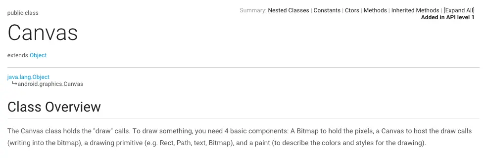

Surface就像是一块洁白的画板，这在前面有介绍到，那如果想要在这块画板上画画，我们就需要用到画笔和颜料，在这里给隆重介绍一下这两位成员：Canvas和Paint。

>Android的Canvas和Java的Canvas不一样的，这里需要注意一下

从官方文档介绍看，Canvas继承自Object对象

>The Canvas class holds the "draw" calls. To draw something, you need 4 basic components: A Bitmap to hold the pixels, a Canvas to host the draw calls (writing into the bitmap), a drawing primitive (e.g. Rect, Path, text, Bitmap), and a paint (to describe the colors and styles for the drawing).
Canvas拥有draw的调用，为了绘制一些东西，你需要4个基本的组件：一个Bitmap用于搁置像素，一个Canvas用于绘制（往Bitmap中画东西），一原始元素（矩形，路径，文本，Bitmap），一个Paint（描述颜色和风格）

而怎么利用Canvas在屏幕上画画呢，Canvas有很多draw开头的方法如：drawRect，drawCircle，drawPath，drawBitmap都是绘制基本元素的，传入的参数一般都是位置 + Paint。

我们以drawRect为例：

形参：float,float,float,float,Paint；
分别代表矩形的左边，上边，右边，下边的位置和矩形的一些特征，位置好理解，那么Paint是什么呢？

>The Paint class holds the style and color information about how to draw geometries, text and bitmaps.
Paint对象拥有待绘制的几何图形，文本和位图的样式和颜色信息。

也就是说Paint是涂料，决定了绘制出来的效果。