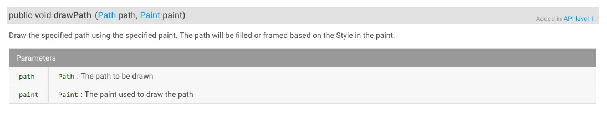
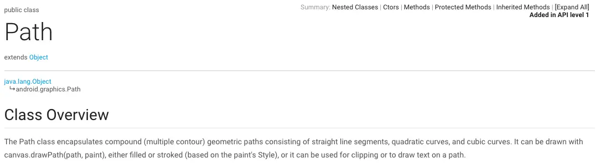

我们经常碰到一些复杂的需要，绘制一些比较复杂的图形，比如做天气App时，经常遇到绘制温度曲线，这个时候，使用基本几何图形肯定是做不到的，那怎么做呢，今天就好好研究一下怎么做温度曲线

Canvas有个方法叫drawPath()

这个方法要求传入一个Path对象，这个Path对象是东西呢，看一下官方文档

从简介来看，Path似乎就是为Canvas准备的，它描述一个路径，用户绘制或者裁切

Path有很多方法，挑几个看看：

- moveTo(float x,float y) `Set the beginning of the next contour to the point (x,y).`
设置下一个轮廓的起点
- lineTo(float x,float y) `Add a line from the last point to the specified point (x,y).`
添加从当前点到(x,y)的一条线
- quadTo(float x1,float y1,float x2, float y2) `Add a quadratic bezier from the last point, approaching control point (x1,y1), and ending at (x2,y2).`
在最末点添加一个二次贝塞尔曲线，