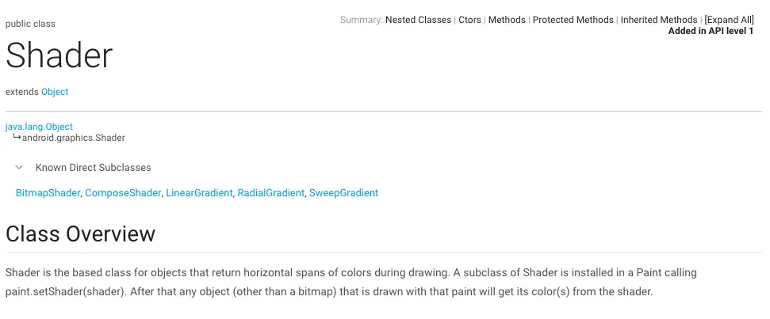
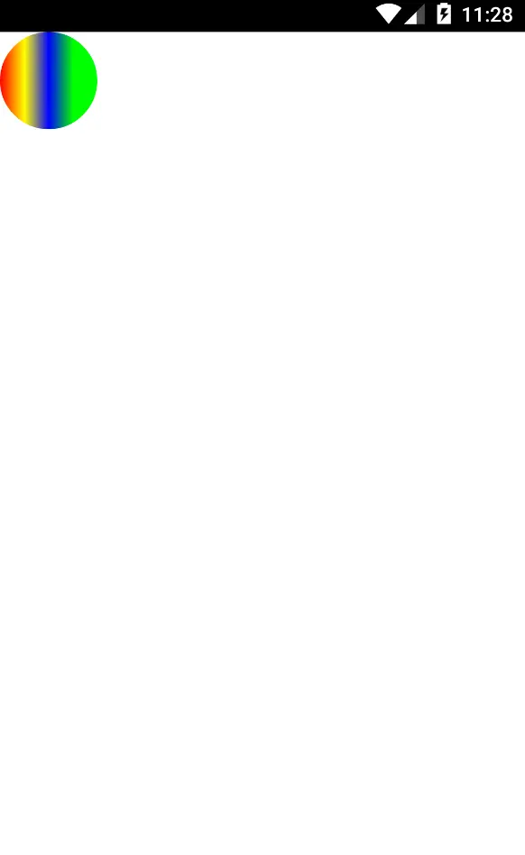

那么，如果我们想要让这个圆形是渐变的呢？怎么才能做到呢？

我们注意到Paint有一个方法：setShader(Shader shader)，shader是着色器的意思，再看看Shader类的介绍：

### Shader

Shader是一些类的基类，这些类在绘制时返回水平跨度颜色，如果Paint调用了setShader(Shader shader)方法，那么所有（除Bitmap)的绘制颜色都会从shader中取。

再看看Shader有哪些子类：
BitmapShader,ComposeShader,LinearGradient,RadialGradient,SweepGradient.

我们找LinearGradient看一看：
[LinearGradient](http://developer.android.com/reference/android/graphics/LinearGradient.html#LinearGradient(float, float, float, float, int[], float[], android.graphics.Shader.TileMode))(float x0, float y0, float x1, float y1, int[] colors, float[] positions, [Shader.TileMode](http://developer.android.com/reference/android/graphics/Shader.TileMode.html) tile)

参数依次说明：
- x0:起始位置x坐标
- y0:起始位置y坐标
- x1:截止位置x坐标
- y1:截止位置y坐标
- colors:颜色数组
- positions:颜色对应的位置，从0-1；
- tile:排列方式，分别有固定、重复、镜像

还是以上面圆形为例：

    paint.setShader(new LinearGradient(0.0f,0.0f,200.0f,0.0f,new int[]{Color.RED,Color.YELLOW,Color.BLUE,Color.GREEN},new float[]{0,0.25f,0.5f,0.75f}, Shader.TileMode.REPEAT));
我们给Paint设置Shader后，看看显示效果：

看到了吗？颜色变啦...