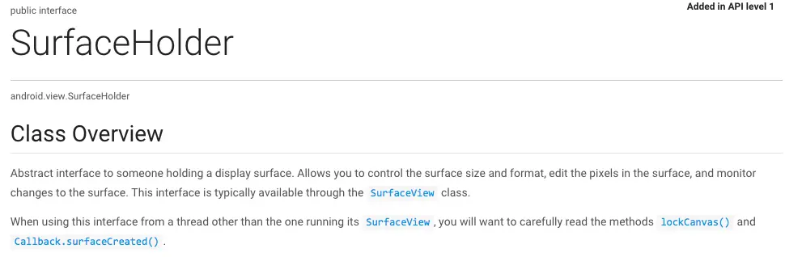
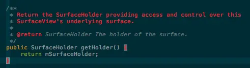
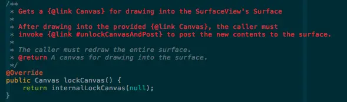
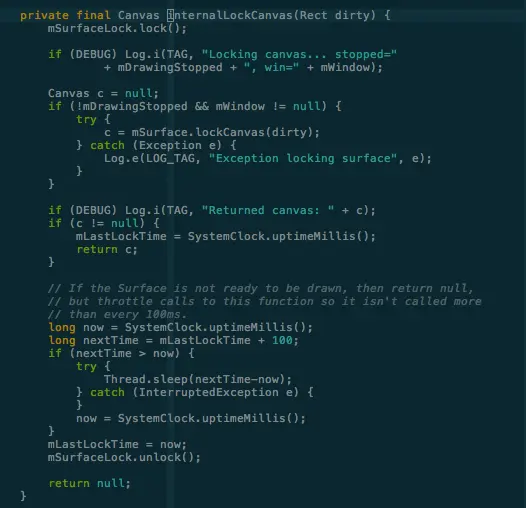
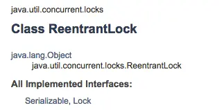
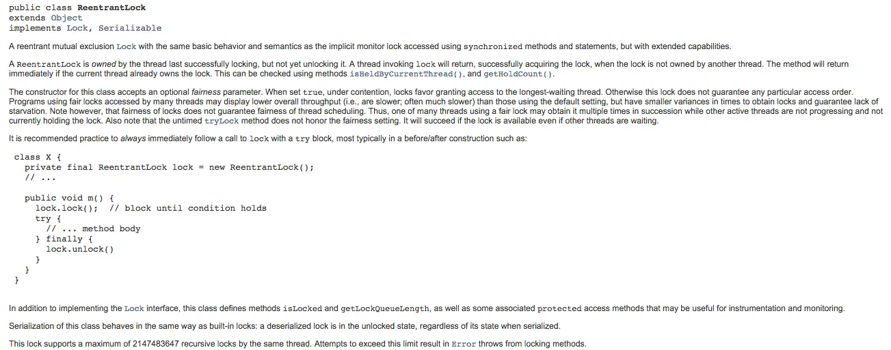
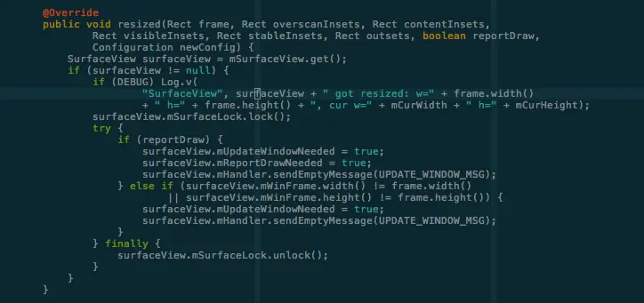

前面了解了什么是SurfaceView和SurfaceView的简单使用，现在要学习怎么在SurfaceView中画画。

    class OurView extends SurfaceView implements Runnable{
        SurfaceHolder holder;
        ...
        public void OurView(Context context){
            holder = getHolder();
        }
        public void run(){
            while(isRunning){
                //判断Surface是否已经准备好
                if(!holder.getSurface().isValid()){
                    continue;
                }
                Canvas canvas = holder.lockCanvas();
                //draw somethings...
                holder.unlockCanvasAndPost(canvas);
            }
        }
        ...
    }

在上面的代码中，有一个类叫SurfaceHolder，这个又是什么东西呢？

SurfaceHolder在android.view包下，是一个接口，“一个为某些类提供一块Surface的抽象接口，你可以通过他控制Surface的尺寸和格式，编辑Surface的像素，监控Surface的变化，这个接口通常用于SurfaceView类，当不止一个线程访问SurfaceView时，你需要格外小心使用lockCanvas()和Callback.surfaceCreated()”

上面提到了lockCanvas()，在前面介绍什么是SurfaceView中有提到这个方法，不过是在Surface类中，那么，SurfaceHolder中也有这个方法，他们之间有什么关系呢，去SurfaceHolder看一下源码：

mSurfaceHolder是一个属性，再去看看SurfaceHolder的lockCanvas()方法

继续看internalLockCanvas();

该方法要求传入一个矩形区域，返回一个Canvas对象，看看里面做了什么

首先调用mSurfaceLock.lock(),mSurfaceLock是一个ReentrantLock，什么是ReentrantLock？

首先，该类是在java.util.concurrent.locks包下，由此可见，它是一个工具类，同时也是跟锁有关，在java中，synchronized同步锁是我们常常见到的，那么ReentrantLock是什么锁呢？

ReentrantLock是一个可重入互斥锁，相较于Synchronized，它支持类似锁投票，定时锁等候和可中断锁等候，同时，性能更高。

也就是说，mSurfaceLock.lock()是为了保证internalLockCanvas的原子性。

再看internalLockCanvas();

            Canvas c = null;
            if (!mDrawingStopped && mWindow != null) {
                try {
                    c = mSurface.lockCanvas(dirty);
                } catch (Exception e) {
                    Log.e(LOG_TAG, "Exception locking surface", e);
                }
            }

>这段代码中，有两个未知属性，mDrawingStoped和mWindow：
mDrawingStoped:Boolean，主要是记录是否需要绘制的标记，如果UNVISIABLE了，就是true，否则为false；
mWindow对应的类MyWindow是个什么东东，MyWindow是继承自BaseIWindow类，重写了resized方法，

resized中主要是想mHandler发送消息，重绘窗口，mHandler收到消息后，调用updateWindow方法更新窗口。

紧接着，执行mSurface.lockCanvas(dirty)方法，前面介绍个，改方法会返回一个Canvas用于在dirty这个矩形区域绘制
>如果dirty为null，则表示整个窗口。

由此可见holder.lockCanvas()，最后实际执行的还是Surface.lockCanvas(dirty)方法，得到Canvas后，我们便可以利用Canvas开始绘制我们想要的任何东西。
>记得在绘制完成后，调用holder.unlockCanvasAndPost(canvas)将绘制的内容发送给Surface。