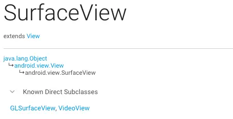
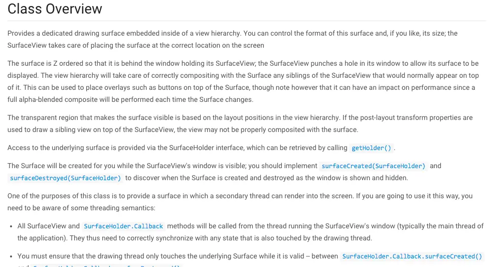
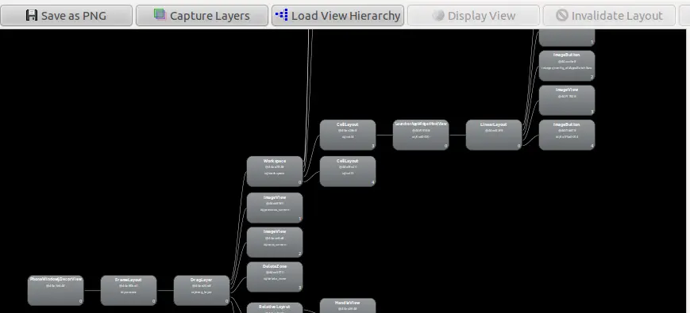
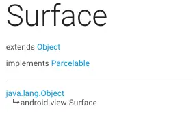
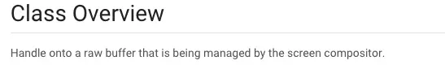
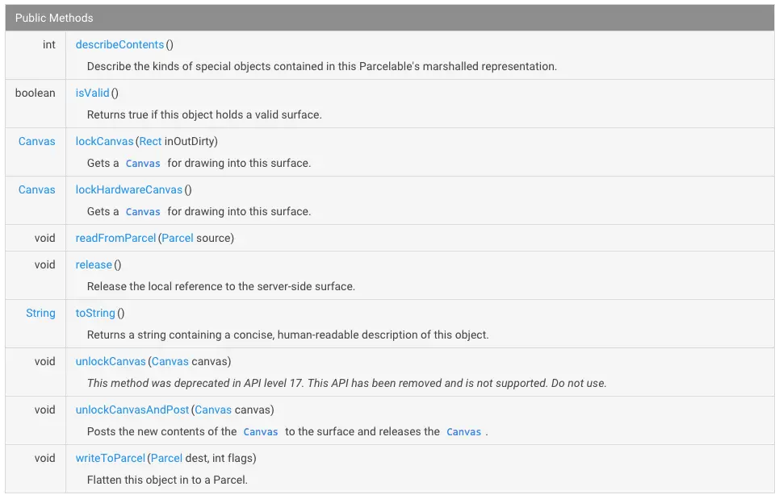
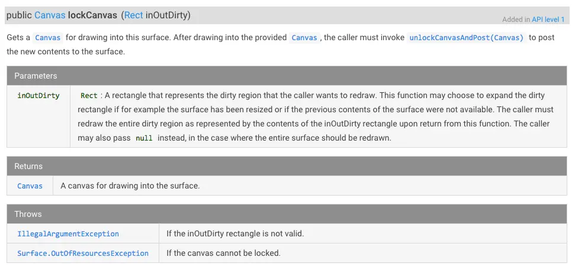

在一般的Android程序中，UI都是在主线程处理，但是，有些可能比较复杂的动画会卡顿主线程，如相机，为了解决这个问题，Android提供了SurfaceView，即在非主线程绘制UI。
>SurfaceView在android.view包下，从Android1.0开始支持。
    
    public class MySurface extends SurfaceView implements Runnable{}

从中可以看出，我们在使用`SurfaceView`时，一般是自定义一个类，并继承`SurfaceView`和`Runnable`，熟悉Java的应该能知道，`Runnable`是实现多线程的接口，由此可见，我们定义的`MySurface`有多线程的特征。

那`SurfaceView`又是什么呢？    

从官方文档看，`SurfaceView`继承自android.view.View，也就是说，`SurfaceView`也是和`ImageView`，`TextView`类似的一个普通的View。

然后再看看官方对`SurfaceView`的介绍：

第一句`提供一个嵌入在View树，专用于绘制Surface`，View树我想大家都知道类似如下，可以用Android Tool：View Hierarchy查看

那什么是Surface呢？

从中可以看到，`Surface`继承自`Object`而不是`View`，且实现了`Parcelable`，可见`Surface`不是一个传统意义上的`View`。
再看看官方介绍

介绍很简短的一句话：由屏幕显示内容合成器（screen compositor)所管理的原始缓冲区的句柄，从中可以看到，`Surface`是个句柄，通过这个句柄，可以获得原始缓冲区及其内容，原始缓冲区用于保存当前窗口的像素数据。

从`Surface`的公开方法中，可以看到有一个`lockCanvas`方法，传入一个矩形区域，返回一个`Canvas`。
`Canvas`大家应该很熟悉，从字面直译是画布的意思，也就是说，你可以在`Canvas`这块画布上绘制你想要的图像，实际上也是这个用途

看一下`lockCanvas`的介绍

从`Surface`获取一块画布用于绘制，在绘制结束后，调用者必须执行`unlockCanvasAndPost(Canvas)`来将新绘制的内容发送到`Surface`。

再看看参数`inOutDirty`：调用者想要重新绘制的一块废弃区域，这个方法可以被用于扩展dirty区域，比如像缩放`Surface`，调用者也可以传递`null`，如果是这样的话，整个`Surface`应该被重新绘制。
而`unlockCanvasAndPost(Canvas)`这个方法则是将`Canvas`中绘制的内容发送给`Surface`。

由此可见，虽然`Surface`没有继承自`View`，但是它拥有一块可绘制区域用于绘制内容，但是因为它没有继承自`View`，所以不能直接用于`View`树。

说到这里，应该能明白`SurfaceView`是什么了吧，接着看`SurfaceView`官方文档：

`You can control the format of this surface and, if you like, its size; the SurfaceView takes care of placing the surface at the correct location on the screen`：“你可以控制`Surface`的格式，甚至尺寸，和位置”，从这里可以看出，SurfaceView存在的意义就是将不可以插入View hierarchy的`Surface`转为可以插入的`SurfaceView`。

`The surface is Z ordered so that it is behind the window holding its SurfaceView; the SurfaceView punches a hole in its window to allow its surface to be displayed. The view hierarchy will take care of correctly compositing with the Surface any siblings of the SurfaceView that would normally appear on top of it. This can be used to place overlays such as buttons on top of the Surface, though note however that it can have an impact on performance since a full alpha-blended composite will be performed each time the Surface changes.`
`Surface`是在Z轴的，所以它应该在`SurfaceView`的底部，`SurfaceView`在自己身上打了个洞以便让`Surface`能被看到，View hierarchy会正确的显示`Surface`的位置，其他的`View`也可以出现在它的上方，这可以用于将一个按钮放置在`Surface`的上方，需要注意的是，将一个透明的按钮放置在`Surface`的上方，每次`Surface`的变化都会导致按钮的重新绘制。

再看看这句`Access to the underlying surface is provided via the SurfaceHolder interface, which can be retrieved by calling getHolder()`“需要访问底层的`Surface`，你可以通过提供的`SurfaceHolder`来访问，`SurfaceHolder`可以通过`getHolder()`得到”。

`The Surface will be created for you while the SurfaceView's window is visible; you should implement surfaceCreated(SurfaceHolder) and surfaceDestoryed(SurfaceHolder) to discover when the Surface is created and destroyed as the window is shown and hidden.`
只有`SurfaceView`可见是，`Surface`才会被创建，你可以继承`surfaceCreated`和`surfaceDestoryed`获得。

到此，`SurfaceView`是什么应该能明白了吧。