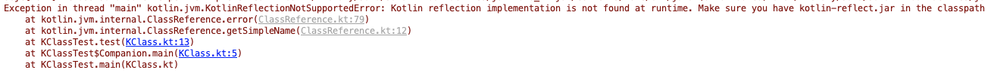
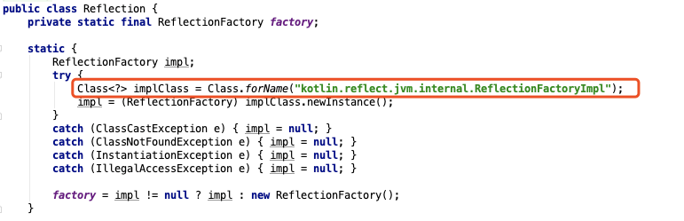

- 发现我一直分不清 Java 的 class,Class，后来用了 Kotlin 又有了 KClass，然后就越来越乱了，简单梳理一下
- 首先，Java 里面所有类的基类是 Object，Kotlin 中叫 Any
- 然后，Class 和你自己定义的类一样，也是一个普通的类，继承自 Object，只不过这个类你不能通过 new 创建，一般由 Jvm 创建
- 然后看一个例子
- ````
    class Test{}
    Class<Test> c1 = Test.class;
    Class c2 = new Test().getClass();
    System.out.println(c1 == c2);
    ````
- 这里例子返回的是 true，也就是说 c1 和 c2 是同一个实例
- 但是这里当我要给 c2 加一个泛型限定时编译器报错:
- 
- 因为 `.getClass()` 是 Object 的一个方法，它返回的是一个 Class<?> 类型
- `public final native Class<?> getClass();`
- 然后看了一下 .class 命令对应的字节码是：
- 
- ldc 命令是将常量池里的数据压入栈顶的意思，这里指的是 `#10` 号常量
- 
- 看到类型为 Class 的 Test 被作为常量存储在常量池中，注意这里不是 Test 对象，而是 Class 对象
- 既然是常量，那肯定全局只有一份，不管你有多少个 Test 实例，都只有一份对应的 Class
- 而上面提到的 Object.getClass() 是 Object 的一个方法，它是一个 Native 方法
- 查了一会没有找到最终的实现，但是最后应该也是从常量池取得这个对象
- 另外 Java 推荐直接通过 `Test.class` 这种方式取得 Class 对象，不推荐使用 `.getClass()`
- 那 Class 里面有些什么东西呢？
- 其实主要存储类的一些信息：
    - 包名，类名，父类，类型，注解，全局变量，方法等等
- 主要用途
    - 区分运行时对象的类型
    - 反射：Class 提供一些根据名字获取属性和方法的接口，根据类名构造对象也是反射的一种
- Kotlin 里有个类叫：KClass，看起来和 Java 里的 Class 好像，通过 `XXXX::class` 获取
- `val c = Test::class`
- 这是 Kotlin 的一个语法糖，实际执行的代码是：
- `KClass c = Reflection.getOrCreateKotlinClass(Test.class);`
- 注意，这里传了一个 Java 的 Class 对象
- 昨天说 Java 里的 Class 对象是由 Java 虚拟机在加载类的时候创建的，但是 Kotlin 并没有修改 JVM，那么理论上 KClass 应该不是 JVM 创建的，
- 通过上面的代码找一下 Reflection 类，这个类是一个 Java 类，原来在 Kotlin 库里还混合着 Java 代码，
- `return new ClassReference(javaClass);`
- 最后发现返回一个 ClassReference 类，也就是说 KClass = ClassReference
- 这个类在 IDE 里看不见，去 GitHub 里找到 [ClassReference](https://github.com/JetBrains/kotlin/blob/deb416484c5128a6f4bc76c39a3d9878b38cec8c/libraries/stdlib/jvm/runtime/kotlin/jvm/internal/ClassReference.kt)
- 这个类继承自 KClass 和 ClassBasedDeclarationContainer
- 发现它给一些重写方法直接报 error
- 
- 执行了一个 `c.simpleName` 试了一下果然直接报错
- 
- 这个类基本是个空实现，没什么内容
- 然后 Kotlin 中获取 Java Class 对象则是：
- `val c = Test::class.java` 或者 `val c = Test().javaClass`
- 第一种方法是一个扩展属性，最后调到了上面传入的那个 Test.class
- 第二种方法就直接调用类 Object.getClass()
- 和昨天讲的 Java 一一对应
- 那为什么上面那个 ClassReference 会给大多数方法都报错？昨天讲 Class 主要的用途是反射，难道 Kotlin 不支持反射吗？
- 查了一下，原来 Kotlin 把反射这一部分单独拆成一个 jar，不需要反射的用户就可以不使用这个包，节省体积，使用的话要单独导一个包
- 加上反射包以后再执行之前报错的代码，果然不再报错了
- 那是什么时候换掉了这个方法呢？
- 上面那个 Reflection 内部实现使用了工厂模式，它的所有方法都是经过一个 Factory 代理执行的，而这个工厂的创建就是实现这个功能的核心
- 
- 通过 Java 的反射，创建一个扩展包里的类，如果这个类能创建成功证明已经引入了反射库，如果创建失败就使用一个皮包工厂代替，返回一堆皮包类
- 如果导入了反射库，那么 KClass 对象的实现是 KClassImpl 对象，这个对象实现了全部反射功能
- 昨天说在 Java 里 Class 是放在常量池里的常量，而 Kotlin 里 KClass 则是放在一个 HashMap 里的一个弱引用[kClassCache.kt](https://github.com/JetBrains/kotlin/blob/master/core/reflection.jvm/src/kotlin/reflect/jvm/internal/kClassCache.kt)
- 而如果没有导入反射则直接 new 一个对象敷衍了事，所以下面的对比应该是 false
- 
- 但是实际上它返回的是 true，这么快就打脸了😅
- 看了一下代码发现 ClassReference 重写了 equals 和 hashCode 方法
- 
- 另外在 Kotlin `==` 默认是 equals 的实现，如果要对比引用相等是 `===`，三个等号打印出来的果然是 false