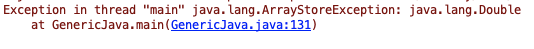

[什么是协变什么是逆变可以参考这里](https://zh.wikipedia.org/wiki/%E5%8D%8F%E5%8F%98%E4%B8%8E%E9%80%86%E5%8F%98)

定义 3 个类，注意继承关系：
````
static class Goods{}
static class Cloth extends Goods{}
static class TShirt extends Cloth{}
````
> Cloth 虽然继承 Goods 但是 List\<Goods> 和 List\<Cloth> 不是父子关系
> 协变就是要让 List\<Goods> 成为  List\<Cloth> 的爸爸（对不起，其实我是你爸爸，哈哈）
> Java 中数组比较特殊，Goods[] 天生就是 Cloth[] 的爸爸，也就是天生支持协变

现在我们声明三个协变 List：
````
// 这一句编译器报错
List<? extends Cloth> extendsList1 = new ArrayList<Goods>();
List<? extends Cloth> extendsList2 = new ArrayList<Cloth>();
List<? extends Cloth> extendsList3 = new ArrayList<TShirt>();
````

很好理解，`? extends Cloth` 指定的类型是 Cloth 或者它的子类，而 Goods 是 Cloth 的父类

再声明三个逆变 List：
````
List<? super Cloth> superList1 = new ArrayList<Goods>();
List<? super Cloth> superList2 = new ArrayList<Cloth>();
// 这一句编译器报错：
List<? super Cloth> superList3 = new ArrayList<TShirt>();
````

意思是类型不统一，因为 `? super Cloth` 指定的类型是 Cloth 或者它的父类，而 TShirt 是 Cloth 的子类

上面的内容都很容易理解，下面看两个不好理解的问题，也是协变和逆变的问题
首先是协变的情况：
````
List<? extends Goods> extendsList = new ArrayList<>();
Goods goods = extendsList.get(0);
extendsList.add(new Goods());// 这句报错
````
看一下 List 的这两个范型方法定义：
````
E get(int index);
boolean add(E e);
````
第一句没有报错， E 的范围是 `? extends Goods`，是 Goods 的不明确子类，可能是自己/儿子也可能是孙子，但是不管怎么远肯定是 Goods 的后代，都可以用 Goods 代表，所以 `Goods goods = extendsList.get(0)` 没有问题
而 `extendsList.add(new Goods())` 这句就却会报错，因为 E 是 Goods 的不明确子类，它究竟是 Goods 还是 Cloth 或是 TShirt 编译器也不确定，假设实际类型是 TShirt 但是你硬要往里放 Cloth 或者 Goods，那编译器肯定不干，所以干脆就不清楚的都不允许插入。

逆变的情况：
````
List<? super Goods> superList = new ArrayList<>();
superList.add(new Cloth()); 
Goods goods = superList.get(0);// 这句报错
````

再看一下 List 的这两个范型方法定义：
````
E get(int index);
boolean add(E e);
````
这有是为啥呢？ 首先 E 的范围是 `? super Goods`，也就是 Goods 的父类，暂时叫他超级父类，此处 `add(new Cloth())` 中 Cloth 是 Goods 的子类，自然是 E 的子类，所以没有任何问题，
但是 superList1.get(0) 返回的是一个 Goods 的超级父类，自然无法自动向下转型成 Goods

所以其实造成这种情况的根本原因还是因为：语言一般允许自动向上转型，但是无法自动向下转型。比如 Integer 可以自动专为 Number 但是 Number 无法自动专为 Integer。

《Effective Java》给出精炼的描述：producer-extends, consumer-super（PECS）
producer 是生产者，返回值是范型，
consumer 是消费者，形参是范型，
放在这里就可以理解成：get-extends, add-super
抽象一下：x=f() - extends, f(x) - super

#### One more thing

````
Number number[] = new Integer[3];
number[0] = 123;
number[1] = 123.2; // 此处运行时报错
````


上面的写法如果用集合表示是这样的：
````
List<? extends Number> list = new ArrayList<Integer>();
list.add(123); // 此处编译时报错
````


但是遗憾的是，`list.add() `直接在编译器报错

数组是支持协变，但是编译器不会限定往里塞入数据，如果往里放不合法的元素只有在运行时会报错，
网上查资料说在给数组在赋值时会检查数据类型，而 List 或者说集合不检查，所以数组可以任性的不需要在编译期检查，如果存入不合法数据在运行时报错。

这么对比下来，数组的协变其实比集合稍微强一点，它允许你赋值合法的数据，而集合直接简单粗暴的禁止。