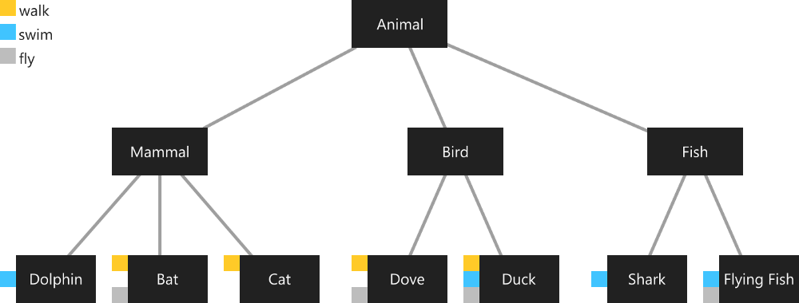

- Dart 是单继承的，但也像 JavaScript 那样支持 mixin ，算是对单继承局限性的扩展
- 比如下面这种写法：
- `class A extends B with C, D, E {}`
- A 继承了 B，同时 A 也继承了 C，D，E
- 虽然写法上不支持多继承，但实际这不就是多继承么，甚至 A 可以向上转型成 B，C，D，E 任意一个
- 记得当初看那本厚厚的 Java 编程思想时专门说 Java 禁止多继承就是觉得 C++ 的多继承太混乱了
- 那为什么要实现这个迷信功能呢？
- 他们是这么解释的
- 
- 上面基类是 Animal 下面分别是 哺乳动物，鸟类，鱼类，然后又是具体的动物
- 其中海豚会游泳，鸽子会飞和行走，蝙蝠会飞等等
- 也就是说同样是哺乳动物，有的会走路，有的会游泳，他们的能力并不一样，这些能力并不应该是继承来的
- 而是应该先设定某些能力，而一些动物刚好有这个能力
- 这里抽象了三个能力：Walker，Flyer，Swiming，分别 with 给对应的动物
- 所以最终的继承是这样的
- `class Dolphin extends Mammal with Swiming {}`
- `class Dove extends Bird with Walker, Flyer {}`
- `class Cat extends Mammal with Walker {}`
- 好像有一定的道理
- 另外如果有方法重写优先级是：直接继承优先级最高，剩下的 with 最右边优先级最高