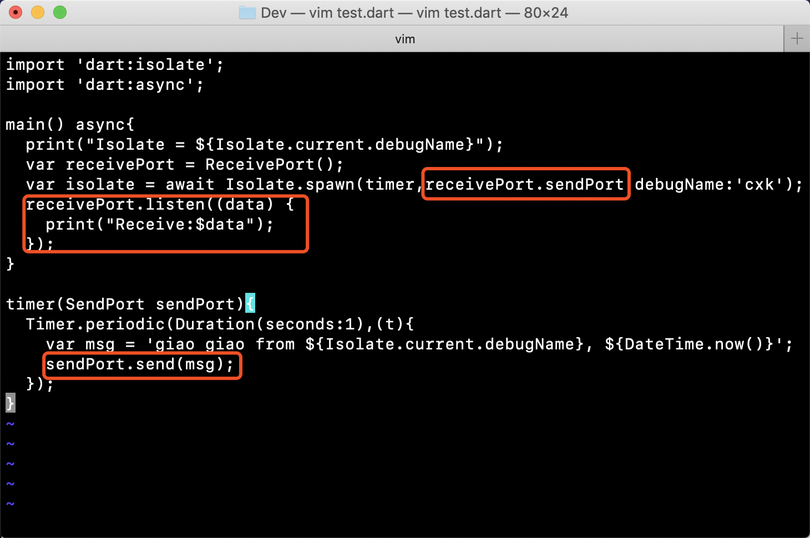
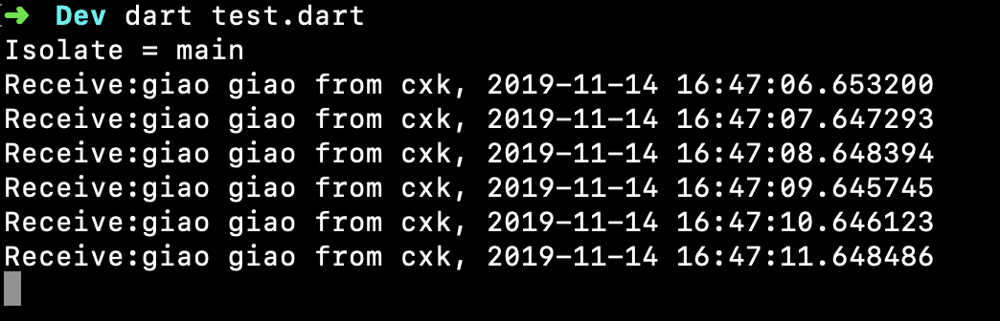
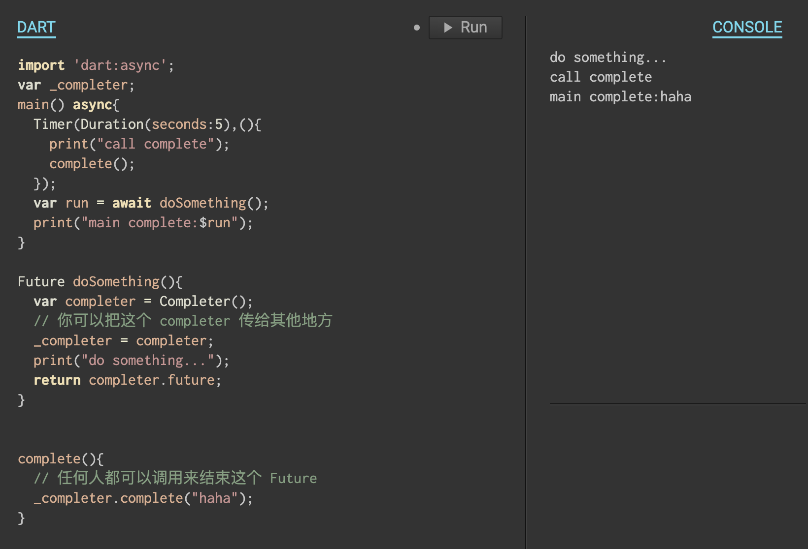

- Dart 里面的 `async` 方法
- 在 Dart 里，一个方法可以像 js 那样添加 async 关键字，声明为 async 的方法返回的是一个 Future<T> 对象
- 在方法体里可以用 await 等待其他的 async 方法的返回结果
- 为了解 async 方法，先要知道 Dart 的线程启动过程
- 1. Dart 在启动线程时首先给每个线程创建两个队列：MicroTask 和 Event
- 2. 然后执行 main 方法
- 3. 启动事件循环读取两个队列中的消息
- async 方法不能简单的理解为一个异步执行的方法，因为它还是在当前线程执行，只不过是稍后执行，所以如果在 async 做耗时的任务还是会卡主线程
````
methodA() async{
  print("methodA start"); // 这部分代码同步执行
  methodC(); // 塞到 Event 队列执行，但不会暂停方法执行
  await methodC();// 暂停方法其他部分的执行
  print("methodA end"); // 等 methodD 执行完以后恢复执行
}
````
- 结论：async 并不是真的异步，适合做一下简短的稍后执行的任务，如果要做一些耗时的比如加载大图，应该使用 Isolate，启动一个真正的线程去执行

- Dart 里面没有传统的 Thread 线程，而是一个叫 Isolate 的东西，翻译叫隔离
- 应该是学的 golang，Isolate 之间是内存隔离的，Isolate 之间通过 ReceivePort 通信，但是用起来没有 golang 方便
- 创建一个线程通过 Isolate.spawn(fun,port)，那个 fun 是你要在 Isolate 中执行的代码，像 Java 的 run 方法，但是必须是一个顶层方法或者静态方法，所以直接传一个匿名方法是不行的
- ReceivePort 是用来通信的接口，完整代码是这样的
- 
- 
- 但是我在使用的时候发现个恶心问题，只能从新 Isolate 往回发送消息，没法从主 Isolate 往新 Isolate 发消息
- 那个 ReceivePort 只能单向发送，这就麻烦了，但是也不是没有解决办法
- 只能在新创建的 Isolate 创建一个 ReceivePort，然后把 ReceivePort.sendPort 发送回主 Isolate
- 主 Isolate 收到这个 SendPort 就可以发送消息过去了，但是感觉很麻烦，为什么不直接支持双向发送消息呢？
- 另外由于有个消息队列，Isolate 创建以后不像传统线程那样自动停止，需要手动调一下 kill 才能停止

- Completer
- Dart 做异步操作一般都是直接使用 Future，就像下面这样
- `new Future(() { doSomething(); return result; });`
- 然后调用者使用的时候可以选择 await 挂起等待结果，也可以使用 `Future.then((data){ //接受数据 })` 通过回调监听
- 但是有时候你并不想马上结束这个 Future，你想再等等，具体等什么也不知道，反正就是再等等
- Dart 提供了一个 Completer 接口，可以帮你处理这种逻辑，使用方式很简单
- 