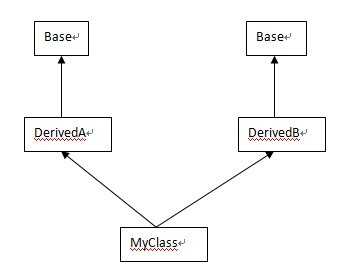

- 最近听到一个词：菱形继承，搞 Java 的很少听到
- 假设 A 类和 B 类从 X 派生，且类 C 同时多继承 A 和 B，那么 C 的对象会拥有两套 X 的实例数据（可以分别独立访问）
- 
- 这种情况下，假设 X 类中的有个属性 f ，A 和 B 都会独立继承 X.f ， C 像要访问 X.f 时要显式的指定：
- `A::f，B::f`
- 为了解决这个问题，虚继承的概念被设计出来 A 和 B 都虚继承自 X，X 是虚拟基类
- 
- 虚拟基类是共享的，A 和 B 继承的是同一个 X 的实例
- 网上查资料讲的都是 C++ 的例子，是不是只有 C++ 有这个问题？