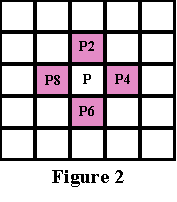
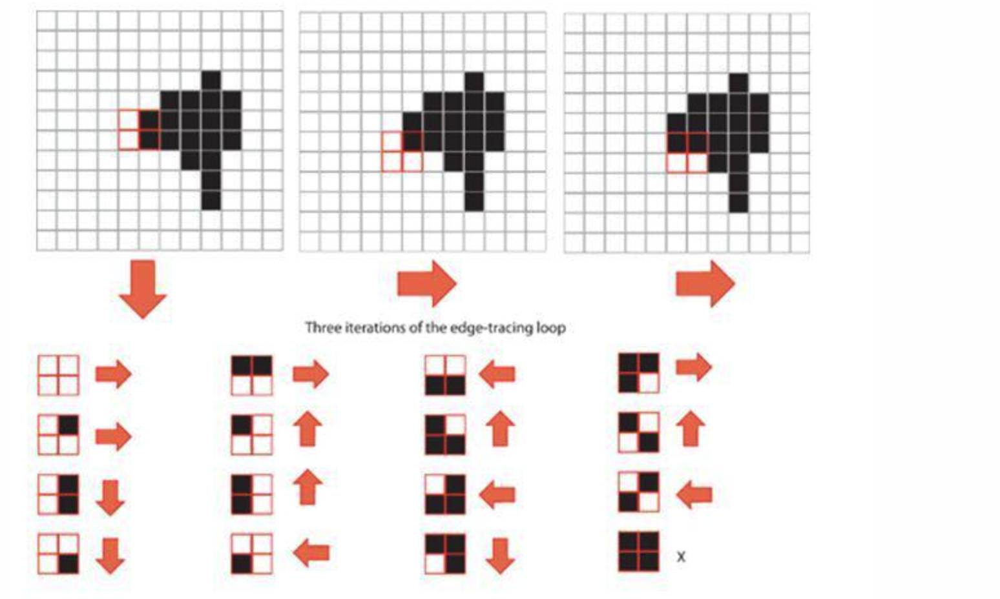

- 图片内容边界识别
- 1.先将输入的图片转成灰度图，然后顺便做个高斯模糊
- 2.灰度图二值化，一个是用高斯二值化，一个是普通的，然后选择效果好的
- 3.二值化图像查找轮廓
- 4.图像膨胀，再查找轮廓，
- 5.查找包含中心点的矩形，就是最后一张图的红色矩形，然后再用对比步骤3里的轮廓，确定最后的范围
- 高斯二值化我一开始以为是计算一个范围内的高斯值作为闸值，看了 boofcv 实现其实就是对图片进行高斯模糊，然后计算模糊后的平均值
- 比较麻烦的是那个轮廓查找算法，看了一些算法相关的文档只能大概了解
- 首先有个概念是 4 联通 和 8 联通，区别就是检查一个像素周围 4 个像素或是 8 个像素有值
- 
- 我目前了解到核心方案就两种
- 1.边缘 一个 2*2 的正方形，根据像素排列方式，确定下一步朝哪个方向移动，然后沿着边缘转一圈，回到出发点就是一个轮廓，总共有 16 种样式
- 
- 2.先找到一个边缘像素，对该像素进行顺时针或逆时针旋转，半径是1，这样碰到的第一个像素就是要移动的下一个像素