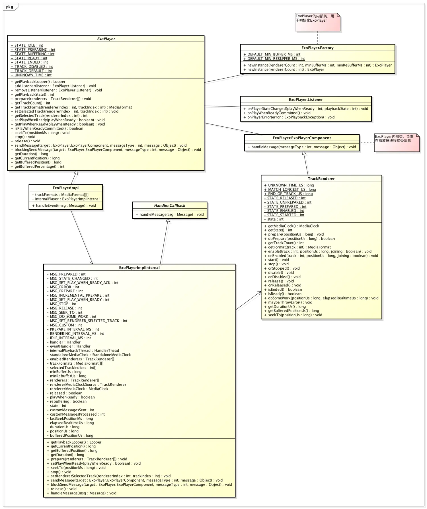
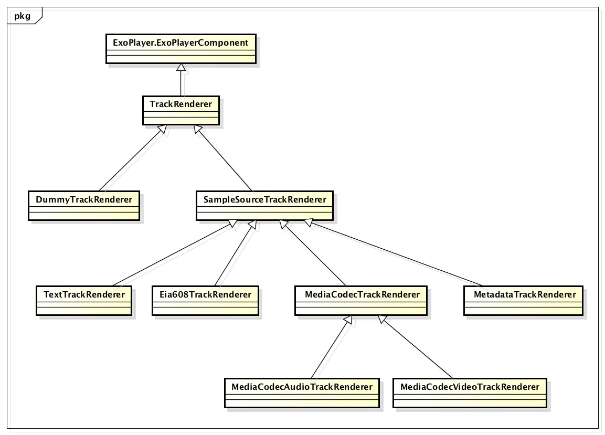
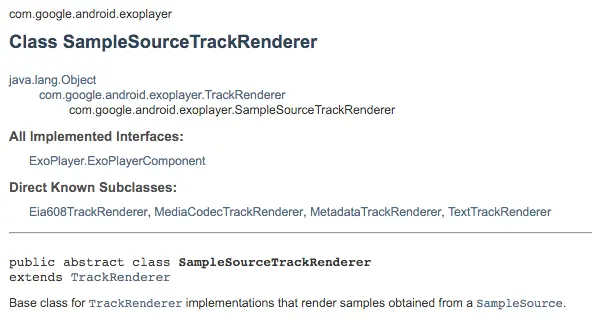
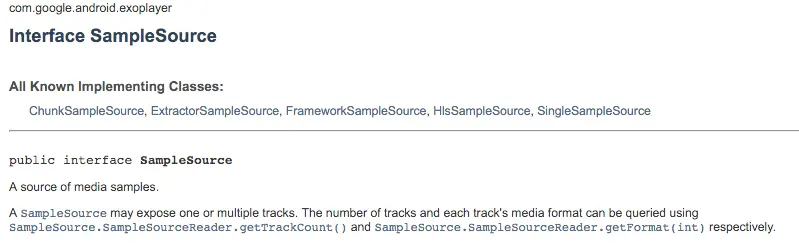
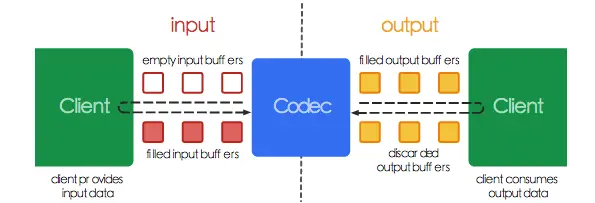

>ExoPlayer is an application level media player for Android. It provides an alternative to Android’s MediaPlayer API for playing audio and video both locally and over the Internet. ExoPlayer supports features not currently supported by Android’s MediaPlayer API, including DASH and SmoothStreaming adaptive playbacks. Unlike the MediaPlayer API, ExoPlayer is easy to customize and extend, and can be updated through Play Store application updates.

首先看看ExoPlayer类之间的继承关系，对这个框架有一个大致的印象

ExoPlayer被定义为Interface，然后又几个内部类：Factory，Listener，其中，Factory负责初始化ExoPlayer的操作，其关键代码如下：

    public static ExoPlayer newInstance(int rendererCount, int minBufferMs, int minRebufferMs) {  return new ExoPlayerImpl(rendererCount, minBufferMs, minRebufferMs);}

Listener则负责向外界回调ExoPlayer状态变化和错误信息。

ExoPlayer有一个子类：ExoPlayerImpl，它继承了ExoPlayer的所有方法，并且负责接收转发外界传递的消息，为什么是转发，不是接收呢？因为真正干活的不是ExoPlayerImpl，而是另外一个隐藏类，ExoPlayerImplInternal，几乎所有的操作都是在ExoPlayerImplInternal中完成的。

# Start
我们看一个官方的使用Demo：

    // 1. Instantiate the player.
    player = ExoPlayer.Factory.newInstance(RENDERER_COUNT);
    // 2. Construct renderers.
    MediaCodecVideoTrackRenderer videoRenderer = ...
    MediaCodecAudioTrackRenderer audioRenderer = ...
    // 3. Inject the renderers through prepare.
    player.prepare(videoRenderer, audioRenderer);
    // 4. Pass the surface to the video renderer.
    player.sendMessage(videoRenderer, MediaCodecVideoTrackRenderer.MSG_SET_SURFACE, surface);
    // 5. Start playback.
    player.setPlayWhenReady(true);
    ...
    player.release(); 
    // Don’t forget to release when done!

>我们下面的探索过程都是按照这个Demo一步一步进行的

#1.Instantiate the player.

首先，用户调用ExoPlayer.Factory.newInstance(...)方法得到ExoPlayerImpl的实例，这个过程中，我们看看做了什么：

    public ExoPlayerImpl(int rendererCount, int minBufferMs, int minRebufferMs) {
        Log.i(TAG, "Init " + ExoPlayerLibraryInfo.VERSION);
        //首先初始化一些状态
        this.playWhenReady = false;
        this.playbackState = STATE_IDLE;
        //ExoPlayer的Listener是通过andListener(listener:Listener)方法添加的，所以需要一个数组去记录所有的Listener
        this.listeners = new CopyOnWriteArraySet<>();
        //初始化轨道格式数组
        this.trackFormats = new MediaFormat[rendererCount][];
        //选中的轨道索引
        this.selectedTrackIndices = new int[rendererCount];
        //初始化一个Handler，并将收到的消息传递给ExoPlayerImpl的handleEvent()方法处理
        eventHandler = new Handler() {
          @Override
          public void handleMessage(Message msg) {
            ExoPlayerImpl.this.handleEvent(msg);
          }
        };
        //初始化ExoPlayerImplInternal
        internalPlayer = new ExoPlayerImplInternal(eventHandler, playWhenReady, selectedTrackIndices,
        minBufferMs, minRebufferMs);
    }

然后我们继续看ExoPlayerImplInternal的构造方法：

    public ExoPlayerImplInternal(Handler eventHandler, boolean playWhenReady,int[] selectedTrackIndices, int minBufferMs, int minRebufferMs) {
        //接受从ExoPlayerImpl传递进来的Handler
        this.eventHandler = eventHandler;
        //初始化
        this.playWhenReady = playWhenReady;
        this.minBufferUs = minBufferMs * 1000L;
        this.minRebufferUs = minRebufferMs * 1000L;
        //拷贝
        this.selectedTrackIndices = Arrays.copyOf(selectedTrackIndices, selectedTrackIndices.length);
        this.state = ExoPlayer.STATE_IDLE;
        this.durationUs = TrackRenderer.UNKNOWN_TIME_US;
        this.bufferedPositionUs = TrackRenderer.UNKNOWN_TIME_US;
        //初始化StandaloneMediaClock类，它是一个时钟类，原理是通过获取手机启动时间进行差值计算
        standaloneMediaClock = new StandaloneMediaClock();
        //初始化一个自增Integer
        pendingSeekCount = new AtomicInteger();
        enabledRenderers = new ArrayList<TrackRenderer>(selectedTrackIndices.length);
        trackFormats = new MediaFormat[selectedTrackIndices.length][];
        // Note: The documentation for Process.THREAD_PRIORITY_AUDIO that states "Applications can
        // not normally change to this priority" is incorrect.
        //初始化和启动一个HandlerThread
        internalPlaybackThread = new PriorityHandlerThread("ExoPlayerImplInternal:Handler",Process.THREAD_PRIORITY_AUDIO);
        internalPlaybackThread.start();
        //为HandlerThread添加一个Handler
        handler = new Handler(internalPlaybackThread.getLooper(), this);
    }

至此，ExoPlayerImpl和ExoPlayerImplInternal两个类的状态都被初始化，启动一个`Process.THREAD_PRIORITY_AUDIO`的线程，准备接受任务。

#2.Construct renderers.

ExoPlayer被初始化后，用户需要调用ExoPlayer.prepare(...)进行准备工作：

    public void prepare(TrackRenderer... renderers);

##### TrackRenderer和它的孩子们
我们看到，prepare形参是TrackRenderer数组，那么这个TrackRenderer是个什么东东呢？

ExoPlayer的媒体组件，都是通过注入的方式实现的，而TrackRenderer就是媒体组件的基类。

    public abstract class TrackRenderer implements ExoPlayerComponent {}

从源码看，TrackRenderer是个抽象类，继承自ExoPlayerComponent，只有一个属性：

    private int state;

大部分方法都是围绕state实现的，剩下的都是抽象方法，TrackRenderer类用来维护state，而具体的工作需要子类去实现，而做法比较巧妙，如TrackRenderer的prepare()方法：

    //prepare方法维护state属性的状态，具体的执行则是调用doPrepare()方法
    final int prepare(long positionUs) throws ExoPlaybackException {
        Assertions.checkState(state == STATE_UNPREPARED);
        state = doPrepare(positionUs) ? STATE_PREPARED : STATE_UNPREPARED;
        return state;
    }

    //抽象方法，由子类实现
    protected abstract boolean doPrepare(long positionUs) throws ExoPlaybackException;

再看看ExoPlayerComponent

    public interface ExoPlayerComponent {
        void handleMessage(int messageType, Object message) throws     ExoPlaybackException;
    }

从名字看，它是一个组件，用于在播放线程接受消息，所有实现它的类都可以在播放线程接受消息，所以TrackRenderer可以接收来自其他线程的消息。

那我们看TrackRenderer有哪些子类

从类图来看，TrackRenderer有很多子类，其中，SampleSourceTrackRenderer比较重要，我们看一下官方文档对这个类的介绍：

##### SampleSource and SampleSourceReader
TrackRenderer的实例，渲染来从SampleSource采集的样本，SampleSource是什么呢，从名字看应该是样本源：

媒体样本源，SampleSource一般暴漏一个或多个轨道，轨道的个数和每个轨道的格式可以通过 SampleSource.SampleSourceReader.getTrackCount()和SampleSource.SampleSourceReader.getFormat(int)得到。

再回头看SampleSourceTrackRenderer的构造方法：

    public SampleSourceTrackRenderer(SampleSource... sources) {
        this.sources = new SampleSourceReader[sources.length];
        for (int i = 0; i < sources.length; i++) {
          this.sources[i] = sources[i].register();
        }
    }
接受一个或者多个SampleSource数组，然后调用了SampleSource的register()方法

    /**
       * A consumer of samples should call this method to register themselves and gain access to the
       * source through the returned {@link SampleSourceReader}.
       * 

       * {@link SampleSourceReader#release()} should be called on the returned object when access is no
       * longer required.
       *
       * @return A {@link SampleSourceReader} that provides access to the source.
       */
    public SampleSourceReader register();

从官方介绍来看，消费者（获取样本的类，这里是指SampleSourceTrackRenderer）通过调用register()方法来获得对媒体样本读取的能力。

register()方法返回SampleSourceReader类：

    /**
       *An interface providing read access to a {@link SampleSource}.   
       */
    public interface SampleSourceReader 

是一个接口，定义了一些访问媒体样本的方法，以下列举一些重要的方法，详细可以去`com.google.android.exoplayer.SampleSource.SampleSourceReader`类查看：

- prepare(long positionUS):boolean
- getTrackCount():int
- getFormat(int track):MediaFormat
- enable(int track,long position)
- disable(int track)
- readData(int track,long positionUs,MediaFormatHolder formatHolder,SampleHolder sampleHolder):int
- seekToUs(long positionUs)
- release()

继续看SampleSourceTrackRenderer的构造方法：

    this.sources[i] = sources[i].register();

SampleSourceTrackRenderer中定义一个全局变量，存储所有的SampleSourceReader，方便其他方法访问SampleSource中的资源。

到这里，ExoPlayer的框架结构就比较清晰了，TrackRenderer负责渲染由SampleSource提供的媒体样本。

#3. Inject the renderers through prepare.

    player.prepare(videoRenderer, audioRenderer);

>前两步分别初始化ExoPlayer、TrackRenderer和SampleSource，并将SampleSource注入到TrackRenderer，但是直到现在，TrackRenderer都没有和ExoPlayer产生关系，客官们是不是等的不耐烦了😃，那么，prepare正是将TrackRenderer注入ExoPlayer，我们通过源码，一步一步看看prepare都做了哪些工作。

ExoPlayerImpl:

    @Override
    public void prepare(TrackRenderer... renderers) {
        Arrays.fill(trackFormats, null);
        internalPlayer.prepare(renderers);
    }

在ExoPlayerImpl中，首先初始化了trackFormats数组，然后调用ExoPlayerImplInternal的prepare(...)方法。

ExoPlayerImplInternal:

    public void prepare(TrackRenderer... renderers) {
        handler.obtainMessage(MSG_PREPARE, renderers).sendToTarget();
    }

ExoPlayerImplInternal.prepare(...)方法通过handler发送一个MSG_PREPARE的指令并传入renderers数组。而这个Handler所在的线程是我们之前讲到的初始化过程中启动工作线程的HandlerThread对应的Handler，那我们找到接受Handler的handleMessage(...)方法：

    @Override
    public boolean handleMessage(Message msg) {
        try {
            switch (msg.what) {
            ...
            case MSG_PREPARE: {
                //如果消息类型是MSG_PREPARE，则调用下面这个方法并返回true
                prepareInternal((TrackRenderer[]) msg.obj);
                return true;
            }
            ...
        } catch (ExoPlaybackException e) {
            Log.e(TAG, "Internal track renderer error.", e);
            eventHandler.obtainMessage(MSG_ERROR, e).sendToTarget();
            stopInternal();
            return true;
        } catch (RuntimeException e) {
           Log.e(TAG, "Internal runtime error.", e);
           eventHandler.obtainMessage(MSG_ERROR, new ExoPlaybackException(e, true)).sendToTarget();
           stopInternal();
           return true;
        }  
    }

    private void prepareInternal(TrackRenderer[] renderers) throws ExoPlaybackException {
          //执行重置工作，主要有：移除handler消息队列中的MSG_DO_SOME_WORD、MSG_INCREMENTAL_PREPARE
          //停止时钟，停止TrackRenderer，释放TrackRenderer，清除缓存等
          resetInternal();
          //将传入的renderers赋值给全局变量
          this.renderers = renderers;
          //将trackFormats置为空
          Arrays.fill(trackFormats, null);
          for (int i = 0; i < renderers.length; i++) {
            //遍历所有的renderer
            //TrackRenderer的getMediaClock()的方法介绍在下面
            MediaClock mediaClock = renderers[i].getMediaClock();
            if (mediaClock != null) {
              Assertions.checkState(rendererMediaClock == null);
              //如果该renderer提供MediaClock，则将该MediaClock赋值为全局变量
              rendererMediaClock = mediaClock;
              rendererMediaClockSource = renderers[i];
            }
          }
          //修改状态为STATE_PREPARING
          setState(ExoPlayer.STATE_PREPARING);
          //增量准备？应该是为了复用代码进行封装的，具体看里面的代码吧
          incrementalPrepareInternal();
    }

>TrackRenderer.getMediaClock()方法介绍：如果这个renderer提供了他自己的播放位置，那么，这个方法会返回对应的MediaClock，如果有，播放器会使用它提供的MediaClock作为视频播放周期，一个播放器中至少有一个Renderer提供MediaClock。

    private void incrementalPrepareInternal() throws ExoPlaybackException {
        //获取当前系统启动时间
        long operationStartTimeMs = SystemClock.elapsedRealtime();
        boolean prepared = true;
        for (int rendererIndex = 0; rendererIndex < renderers.length; rendererIndex++) {
            TrackRenderer renderer = renderers[rendererIndex];
            //如果当前状态为STATE_UNPREPARED，调用TrackRenderer.prepare(...)方法
            if (renderer.getState() == TrackRenderer.STATE_UNPREPARED) {
                int state = renderer.prepare(positionUs);
                //检查状态是否还是STATE_UNPREPARED，如果是则抛出异常
                if (state == TrackRenderer.STATE_UNPREPARED) {
                    renderer.maybeThrowError();
                    prepared = false;
                }
            }
        }

        if (!prepared) {
            // We're still waiting for some sources to be prepared.
            //如果未准备成功，则在PREPARE_INTERVAL_MS时间后重试
            scheduleNextOperation(MSG_INCREMENTAL_PREPARE, operationStartTimeMs, PREPARE_INTERVAL_MS);
            return;
        }

        long durationUs = 0;
        boolean allRenderersEnded = true;
        boolean allRenderersReadyOrEnded = true;
        //再次遍历所有的TrackRenderer
        for (int rendererIndex = 0; rendererIndex < renderers.length; rendererIndex++) {
            TrackRenderer renderer = renderers[rendererIndex];
            //获取每个TrackRenderer的TrackCount(轨道个数)
            int rendererTrackCount = renderer.getTrackCount();
            MediaFormat[] rendererTrackFormats = new MediaFormat[rendererTrackCount];
            for (int trackIndex = 0; trackIndex < rendererTrackCount; trackIndex++) {
                rendererTrackFormats[trackIndex] = renderer.getFormat(trackIndex);
            }
            //记录每个TrackRenderer的每个Track的格式
            trackFormats[rendererIndex] = rendererTrackFormats;
            if (rendererTrackCount > 0) {
                //如果时间为未知时间，则不作处理，（这块没有太看懂，为什么上一个TrackRenderer的durationUs作为这个TrackRenderer的判断依据，
                // 如果上一个TrackRenderer的durationUs = TrackRenderer.UNKNOWN_TIME_US，则之后所有的durationUs都是TrackRenderer.UNKNOWN_TIME_US？）
                if (durationUs == TrackRenderer.UNKNOWN_TIME_US) {
                    // We've already encountered a track for which the duration is unknown, so the media
                    // duration is unknown regardless of the duration of this track.
                } else {
                    long trackDurationUs = renderer.getDurationUs();
                    if (trackDurationUs == TrackRenderer.UNKNOWN_TIME_US) {
                        durationUs = TrackRenderer.UNKNOWN_TIME_US;
                    } else if (trackDurationUs == TrackRenderer.MATCH_LONGEST_US) {
                        // Do nothing.
                    } else {
                        //如果上一个TrackRenderer的Duration和这个TrackRenderer的Duration不一致，则取大的
                        durationUs = Math.max(durationUs, trackDurationUs);
                    }
                }
                //selectedTrackIndices是从ExoPlayerImpl传入的，每个Renderer同时只能有一个track在工作
                int trackIndex = selectedTrackIndices[rendererIndex];
                if (0 <= trackIndex && trackIndex < rendererTrackFormats.length) {
                    //打开对应的Track
                    renderer.enable(trackIndex, positionUs, false);
                    enabledRenderers.add(renderer);
                    allRenderersEnded = allRenderersEnded && renderer.isEnded();
                    allRenderersReadyOrEnded = allRenderersReadyOrEnded && rendererReadyOrEnded(renderer);
                }
            }
        }
        this.durationUs = durationUs;
        //更新ExoPlayer的state
        if (allRenderersEnded
                && (durationUs == TrackRenderer.UNKNOWN_TIME_US || durationUs <= positionUs)) {
            // We don't expect this case, but handle it anyway.
            state = ExoPlayer.STATE_ENDED;
        } else {
            state = allRenderersReadyOrEnded ? ExoPlayer.STATE_READY : ExoPlayer.STATE_BUFFERING;
        }

        //通知ExoPlayerImpl，更改状态
        // Fire an event indicating that the player has been prepared, passing the initial state and
        // renderer track information.
        eventHandler.obtainMessage(MSG_PREPARED, state, 0, trackFormats).sendToTarget();

        // Start the renderers if required, and schedule the first piece of work.
        if (playWhenReady && state == ExoPlayer.STATE_READY) {
            startRenderers();
        }
        // 向Handler发送 MSG_DO_SOME_WORK 命令
        handler.sendEmptyMessage(MSG_DO_SOME_WORK);
    }

紧接着又向handler发送MSG_DO_SOME_WORK命令：

    private void doSomeWork() throws ExoPlaybackException {
        TraceUtil.beginSection("doSomeWork");
        //获取系统启动时间
        long operationStartTimeMs = SystemClock.elapsedRealtime();
        //缓存位置，默认值为durationUs 或 Long.MAX_VALUE
        long bufferedPositionUs = durationUs != TrackRenderer.UNKNOWN_TIME_US ? durationUs
                : Long.MAX_VALUE;
        boolean allRenderersEnded = true;
        boolean allRenderersReadyOrEnded = true;
        //刷新播放时间
        updatePositionUs();
        //遍历所有开启的Renderer
        for (int i = 0; i < enabledRenderers.size(); i++) {
            TrackRenderer renderer = enabledRenderers.get(i);
            // TODO: Each renderer should return the maximum delay before which it wishes to be
            // invoked again. The minimum of these values should then be used as the delay before the next
            // invocation of this method.
            //调用TrackRenderer的doSomeWork，这个后面再说
            renderer.doSomeWork(positionUs, elapsedRealtimeUs);
            allRenderersEnded = allRenderersEnded && renderer.isEnded();

            // Determine whether the renderer is ready (or ended). If it's not, throw an error that's
            // preventing the renderer from making progress, if such an error exists.
            boolean rendererReadyOrEnded = rendererReadyOrEnded(renderer);
            if (!rendererReadyOrEnded) {
                renderer.maybeThrowError();
            }
            allRenderersReadyOrEnded = allRenderersReadyOrEnded && rendererReadyOrEnded;

            if (bufferedPositionUs == TrackRenderer.UNKNOWN_TIME_US) {
                // We've already encountered a track for which the buffered position is unknown. Hence the
                // media buffer position unknown regardless of the buffered position of this track.
            } else {
                //获取实际的缓存位置
                long rendererDurationUs = renderer.getDurationUs();
                long rendererBufferedPositionUs = renderer.getBufferedPositionUs();
                if (rendererBufferedPositionUs == TrackRenderer.UNKNOWN_TIME_US) {
                    bufferedPositionUs = TrackRenderer.UNKNOWN_TIME_US;
                } else if (rendererBufferedPositionUs == TrackRenderer.END_OF_TRACK_US
                        || (rendererDurationUs != TrackRenderer.UNKNOWN_TIME_US
                        && rendererDurationUs != TrackRenderer.MATCH_LONGEST_US
                        && rendererBufferedPositionUs >= rendererDurationUs)) {
                    // This track is fully buffered.
                } else {
                    //一般情况会进入这个条件
                    bufferedPositionUs = Math.min(bufferedPositionUs, rendererBufferedPositionUs);
                }
            }
        }
        //刷新全局缓存位置
        this.bufferedPositionUs = bufferedPositionUs;

        //如果所有的Renderer都是结束状态，或者durationUs = TrackRenderer.UNKNOWN_TIME_US，或者durationUs <= positionUs，
        //则停止渲染
        if (allRenderersEnded
                && (durationUs == TrackRenderer.UNKNOWN_TIME_US || durationUs <= positionUs)) {
            setState(ExoPlayer.STATE_ENDED);
            stopRenderers();
        } else if (state == ExoPlayer.STATE_BUFFERING && allRenderersReadyOrEnded) {
            //如果状态是STATE_BUFFERING，但是所有的Renderer已经准备就绪，则开始渲染，并将状态改为STATE_READY
            setState(ExoPlayer.STATE_READY);
            if (playWhenReady) {
                startRenderers();
            }
        } else if (state == ExoPlayer.STATE_READY && !allRenderersReadyOrEnded) {
            //如果状态已经是READY，但不是allRenderersReadyOrEnded，则当前视频正在缓存，停止渲染，等待缓存
            rebuffering = playWhenReady;
            setState(ExoPlayer.STATE_BUFFERING);
            stopRenderers();
        }

        handler.removeMessages(MSG_DO_SOME_WORK);
        //如何state为STATE_READY或者STATE_BUFFERING，则定时RENDERING_INTERVAL_MS重新执行该方法
        if ((playWhenReady && state == ExoPlayer.STATE_READY) || state == ExoPlayer.STATE_BUFFERING) {
            scheduleNextOperation(MSG_DO_SOME_WORK, operationStartTimeMs, RENDERING_INTERVAL_MS);
        } else if (!enabledRenderers.isEmpty()) {
            //否则，则定时IDLE_INTERVAL_MS重新执行该方法
            scheduleNextOperation(MSG_DO_SOME_WORK, operationStartTimeMs, IDLE_INTERVAL_MS);
        }

        TraceUtil.endSection();
    }

当prepare调用doSomeWork()之后，在整个播放期间，doSomeWork()会一直重复执行。

看完ExoPlayerImplInternal类，我们再去TrackRenderer看一看：

    /**
     * Prepares the renderer. This method is non-blocking, and hence it may be necessary to call it
     * more than once in order to transition the renderer into the prepared state.
     *
     * @param positionUs The player's current playback position.
     * @return The current state (one of the STATE_* constants), for convenience.
     * @throws ExoPlaybackException If an error occurs.
     */
    /* package */
    final int prepare(long positionUs) throws ExoPlaybackException {
        Assertions.checkState(state == STATE_UNPREPARED);
        state = doPrepare(positionUs) ? STATE_PREPARED : STATE_UNPREPARED;
        return state;
    }

    /**
     * Invoked to make progress when the renderer is in the {@link #STATE_UNPREPARED} state. This
     * method will be called repeatedly until {@code true} is returned.
     * 

     * This method should return quickly, and should not block if the renderer is currently unable to
     * make any useful progress.
     *
     * @param positionUs The player's current playback position.
     * @return True if the renderer is now prepared. False otherwise.
     * @throws ExoPlaybackException If an error occurs.
     */
    protected abstract boolean doPrepare(long positionUs) throws ExoPlaybackException;

TrackRenderer的prepare(...)只是修改了state的状态，具体执行交给了子类，上面介绍过的TrackRenderer的子类DummyTrackRenderer,SampleSourceTrackRenderer，其中DummyTrackRenderer我们这里用不到，所以直接看SampleSourceTrackRenderer：

    @Override
    protected final boolean doPrepare(long positionUs) throws ExoPlaybackException {
        boolean allSourcesPrepared = true;
        for (int i = 0; i < sources.length; i++) {
            //这里调用SampleSourceReader.prepare(...)准备资源 :( 层层调用啊，感觉快被绕疯了
            allSourcesPrepared &= sources[i].prepare(positionUs);
        }
        //如其中有资源无法准备就绪，直接返回false，够狠
        if (!allSourcesPrepared) {
            return false;
        }
        // The sources are all prepared.
        // 记录一下所有的轨道个数
        int totalSourceTrackCount = 0;
        for (int i = 0; i < sources.length; i++) {
            totalSourceTrackCount += sources[i].getTrackCount();
        }
        long durationUs = 0;
        int handledTrackCount = 0;
        int[] handledSourceIndices = new int[totalSourceTrackCount];
        int[] handledTrackIndices = new int[totalSourceTrackCount];
        int sourceCount = sources.length;
        // 遍历所有的轨道
        for (int sourceIndex = 0; sourceIndex < sourceCount; sourceIndex++) {
            SampleSourceReader source = sources[sourceIndex];
            int sourceTrackCount = source.getTrackCount();
            for (int trackIndex = 0; trackIndex < sourceTrackCount; trackIndex++) {
                MediaFormat format = source.getFormat(trackIndex);
                boolean handlesTrack;
                try {
                    //判断是否可以处理该媒体格式的轨道
                    handlesTrack = handlesTrack(format);
                } catch (DecoderQueryException e) {
                    throw new ExoPlaybackException(e);
                }
                if (handlesTrack) {
                    handledSourceIndices[handledTrackCount] = sourceIndex;
                    handledTrackIndices[handledTrackCount] = trackIndex;
                    handledTrackCount++;
                    //获得轨道的时长
                    if (durationUs == TrackRenderer.UNKNOWN_TIME_US) {
                        // We've already encountered a track for which the duration is unknown, so the media
                        // duration is unknown regardless of the duration of this track.
                    } else {
                        long trackDurationUs = format.durationUs;
                        if (trackDurationUs == TrackRenderer.UNKNOWN_TIME_US) {
                            durationUs = TrackRenderer.UNKNOWN_TIME_US;
                        } else if (trackDurationUs == TrackRenderer.MATCH_LONGEST_US) {
                            // Do nothing.
                        } else {
                            durationUs = Math.max(durationUs, trackDurationUs);
                        }
                    }
                }
            }
        }
        this.durationUs = durationUs;
        //记录所有可以处理的Source和SourceTrack
        //这块不知道为什么拆成两个数组，其实一个二维数组也是可以的
        this.handledSourceIndices = Arrays.copyOf(handledSourceIndices, handledTrackCount);
        this.handledSourceTrackIndices = Arrays.copyOf(handledTrackIndices, handledTrackCount);
        return true;
    }

在上面的代码中，调用的SampleSourceReader的prepare()方法，这里的SampleSourceReader实际是ExtractorSampleSource，其主要从URL、File、Assets等读取数据做准备，对数据的加载后面会单独分析。

我们再捋一遍prepare的执行过程：

#4. Pass the surface to the video renderer.
     player.sendMessage(videoRenderer, MediaCodecVideoTrackRenderer.MSG_SET_SURFACE, surface);

在进行之前，我们有必要讲一下[MediaCodec](http://developer.android.com/intl/zh-tw/reference/android/media/MediaCodec.html)这个类，呃，其实官方已经介绍的很清楚了，这个类好复杂呀，我们了解一下工作原理就可以了。

先看这一张图，介绍MediaCodec的工作原理，它主要负责两件事：
- 输入外界提供的数据：外界提供一个Input Buffer，发送给MediaCodec处理
- 输出合成后的数据：外界获取由MediaCodec处理过的Output Buffer

######支持的数据类型
MediaCodec支持三种数据
- 压缩数据
- 音频数据
- 视频数据

三种数据都支持通过ByteBuffers的方式传入，但如果传递的是视频数据，需要传递一个Surface提高MediaCodec的性能，Surface使用的是原始视频Buffer，无需转换或拷贝到ByteBuffers，所以它比较高效。

如果使用Surface，通常情况下无法获取到二进制数据，但是你可以用ImageReader读取视频帧，而如果你使用ByteBuffers，你也可以使用Image类读取视频帧。

这是我从别处抄来的一个Demo，具体如何使用[MediaCodec播放视频](https://gist.github.com/goyourfly/25eea8daf167c874c20275e2dd52b10b)

现在我们继续看ExoPlayer的代码，上面看到，调用者向ExoPlayer发送一个消息，消息类型是MSG_SET_SURFACE并传入一个surface，这是因为，MediaCodec需要一个Surface将视频原始Buffer数据直接传递给Surface，那这个消息最后的接受者是谁呢？
答案是：MediaCodecVideoTrackRenderer

    @Override
    public void handleMessage(int messageType, Object message) throws ExoPlaybackException {
        if (messageType == MSG_SET_SURFACE) {
            setSurface((Surface) message);
        } else {
            super.handleMessage(messageType, message);
        }
    }

在MediaCodecVideoTrackRenderer中可以找到这个方法，如果消息类型是MSG_SET_SURFACE，则接受并调用setSurface(surface:Surface)，否则不处理，到这一步以后的处理就属于ExoPlayer调用Android系统的MediaCodec的方法了，在上面我们已经讲过，不再重复。

---
到这里，ExoPlayer的结构大致说完了，如果有什么不懂的，也不用问我，其实...我也不会，O(∩_∩)O哈哈~，去看代码，去看代码，去看代码，重要的事情要说三遍......如果单用一篇文章去彻底弄清楚ExoPlayer是不现实的，而且经过我的过滤，可能会丢掉一些很重要的东西，所以我希望这篇文章只是在你学习ExoPlayer过程中的参考，主要的路径依然是看官方讲解和源码，另外，这篇文章中可能会有错误，如果发现，请及时的告诉我，谢谢！
---