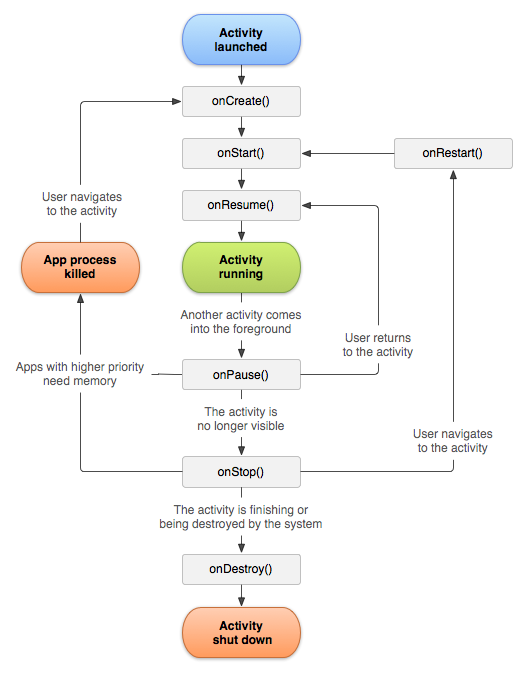
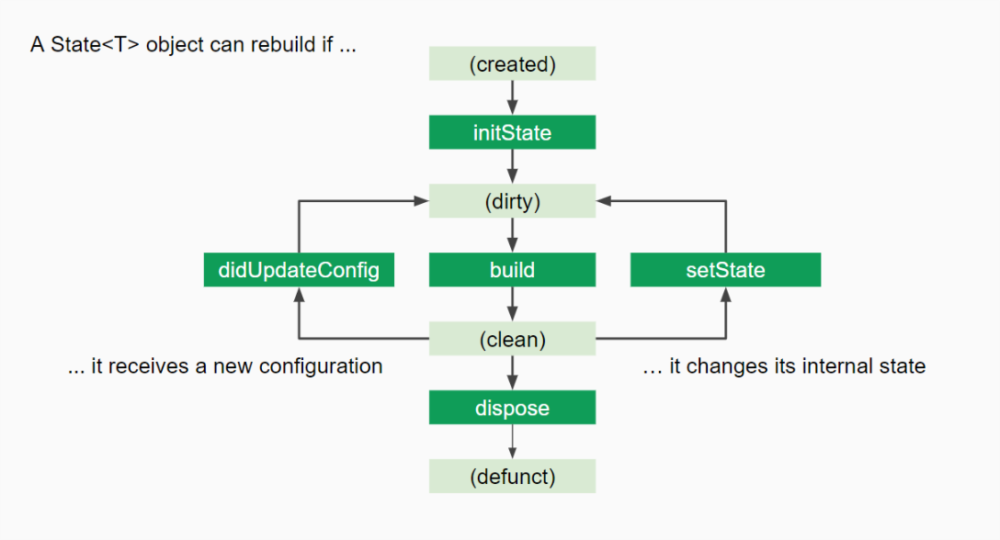

*  Flutter “页面”的生命周期
*  先看一下 Android 页面的生命周期, 看起来很复杂, 状态之间的跳转也很繁琐, 主要的生命周期有: 
*  onCreate -> onStart -> onResume -> onPause -> onStop -> onDestroy
*  
*  再看一下 Flutter 的生命周期
*  
*  Flutter 最主要的生命周期其实只有三个:
*  initState -> build -> dispose
 *  看起来比 Android 简单多了, 为什么会这样呢? 我认为这跟 Flutter 的设计理念有关, 在 Flutter 中, 一切都是 Widget , 淡化了页面的概念(其实整个应用只使用了一个 Native 的页面), 你可以把一个 Widget 单独作为一个页面显示, 也可以让它和其他 Widget 组合形成一个页面, 既然淡化了页面的概念, 那么页面相关的生命周期也自然就没有了, 比如 Android 中的 onPause 和 onResume 这种和页面相关的状态在 Flutter 自然就没有了, 
*  所以写 Flutter 代码说要稍微注意一下, 比如一个页面在播放视频, 这个时候如果要跳转到其他页面, Android 通常的做法说在 onPause 中停止播放, 但是 Flutter 里面没有这个状态, 只能在跳转的地方手动停止播放.