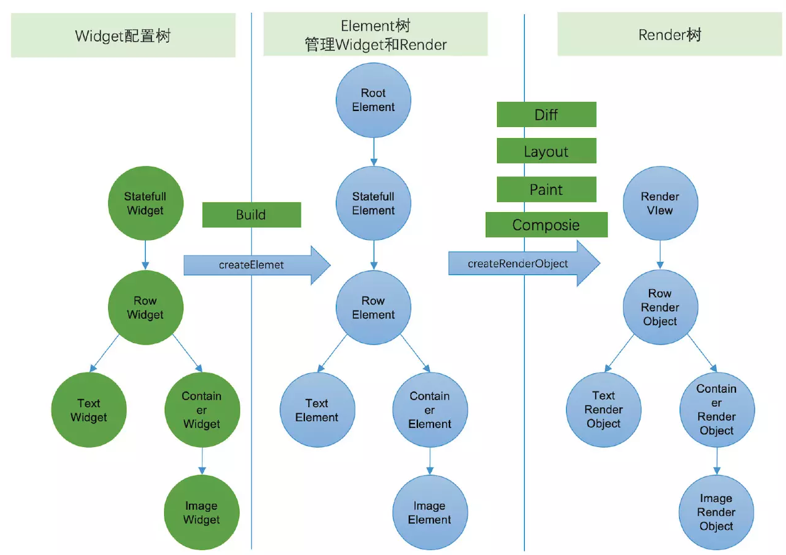

StatelessWidget 对应的 Element 是 StatelessElement
StatefullWidget 对应的 Element 是 StatefullElement
他们都是继承自 ComponentElement

StatelessElement 比较简单，只实现了 get/build/update 三个方法，
其中 get 返回 StatelessWidget
build 直接调用 widget.build
update 是把自己标为 _dirty 并执行父类的 rebuild

StatefullElement 稍微复杂点，里面包含了 state 的逻辑，
在初始化时，将自己传给 StatefullWidget 的 State 类
build 是调用 state.build
_firstBuild 时调用 state.didChangeDependencies
update 时将自己标为 dirty，将新的 Widget 赋值给 state 并执行父类的 rebuild
> 这里就是为什么说 Widget 和 State 声明周期不一样，每次 build，Widget 都会重新创建，而 State 则和 Element 生命周期一致
> 
> 
>   - Flutter 的 UI 框架和 Android 区别很大，更像是 Web
- 比如在 Android 一切界面的基础都是 View，而用户界面就是由一个个 View 嵌套组合而成
- 但是在 Flutter 中，有三个最基础的组件：Widget，Element，RenderObject
- 他们之间的关系是，Widget 通过 createElement 创建 Element，
- Element 创建调用 Widget 的 createRenderObject 创建对应的 RenderObject
- Element 持有 Widget 和 RenderObject 的引用
- RenderObject 执行真正的布局和绘制
- 
- 其中，Widget 被设计为不可变的（Immutable），每次界面刷新都会重新创建，
- 所以 Flutter 把 Android 中的一颗树拆分成三棵树
- Widget 树负责用户输入的数据
- Element 树负责维护中间状态，并创建 RenderObject
- RenderObject 负责最后的布局和渲染
- 一般 UI 更新时调用 setState() 方法，这个方法会把当前 Widget 对应的 Element 标记为 dirty，
- 然后在下次 VSync 信号发出时，执行 Widget 的 build 方法，