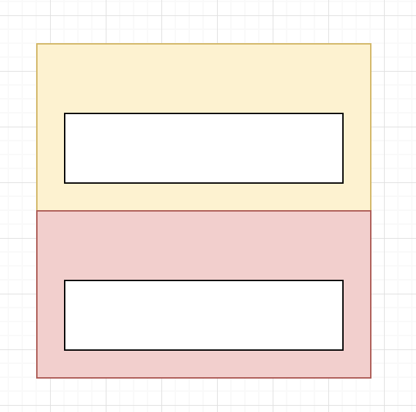
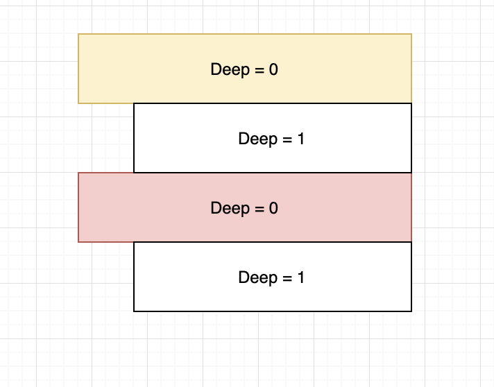

今天用 flutter 写一个递归遍历列表时遇到一个奇怪的现象
````
class Entry {
  final String icon;
  final String text;
  bool expand;
  final bool isCollection;
  final List<Entry> children;
  int deep = 0;
  Entry(this.icon, this.text, this.expand, this.isCollection, this.children);
}
var list = <Entry>[
    Entry("0", "Test0", false, false,
        [Entry("0.1", "Test0.1", false, false, [])]),
    Entry("1", "Test1", false, false,
        [Entry("1.1", "Test1.1", false, false, [])]),
  ];

flatData(List<Entry> list, List<Entry> flatList,int deep) {
  for (var entry in list) {
    flatList.add(entry);
    entry.deep = deep;
    if (entry.expand && entry.children.isNotEmpty) {
      flatData(entry.children, flatList,deep++);// bug 再这里 🙋
    }
  }
  return flatList;
}

var flatList = <Entry>[];
flatData(list,flatList,0)
````
list 的嵌套结构是这样的：


想要的效果是把 list 拍扁，用 `deep` 字段记录深度信息




但运行后发现 deep 变成 `0,0,1,1` ，但实际都深度是 `0,1,0,1`，仔细排查来一下发现应该是 `deep++` 出的问题，原因是因为 `deep++` 先返回自己，再进行 `+1` 运算，所以改成 `deep+1` 就好了，另外 `++deep` 是先 `+1` 再返回自己，但是这里不能用

写到这里突然有点理解科特琳对这块的语法设计：不允许直接修改方法参数，这样就能避免这个不起眼的 bug。


