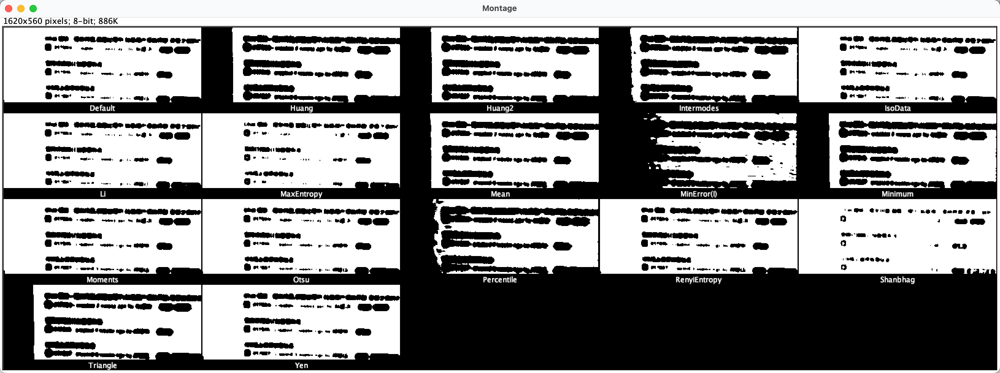

- 图像的二值化，就是把一张图片转成只有黑白两种颜色，实现二值化总体有两种策略：全局二值化和动态二值化
- 全局二值化就是一整张图片只计算一个阈值，比如一张灰度图，每个像素值范围是 0～255，通过特定的算法算出一个阈值 100
- 所有 > 100 的像素都直接设置为 255，< 100 的设置为 0，这样就直接变成一张黑白图了
- 动态二值化就是把图片划分成若干个区域，在每个区域内再计算阈值并进行二值化，这个阈值计算一般使用平均值或者高斯权重算出来的
- 全局二值化的关键点事找到合适的阈值，有很多算法去计算，我测了很多算法最终发现 [OTSU](https://zh.wikipedia.org/wiki/%E5%A4%A7%E6%B4%A5%E7%AE%97%E6%B3%95) 相对好一点
- OTSU 核心思想：把一个灰度图想象成一个 0～255 层，分别计算每一层和之上，之下的方差，最终取方差最大的那个值就是最终的阈值
- 