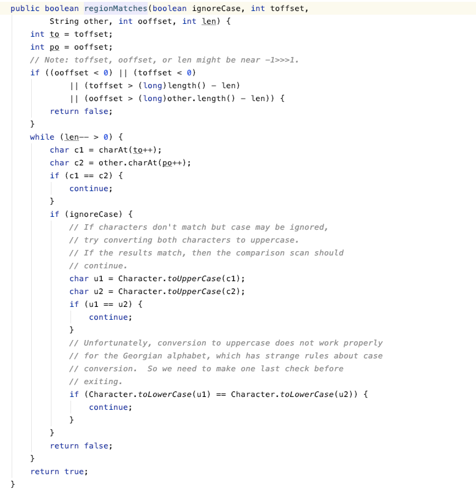

- 看文章说，使用 equalsIgnoreCase 字符串忽略大小写比较可以节省内存
- 普通的做法是先都转成小写或者大些，然后再进行比较，这样会多生成两个字符串，浪费了一点空间
- equalsIgnoreCase 是否真的能节省内存呢？
- 我看了一下它的源码里是逐个比较字符是否相等
- 
- 但是这样也会生成2个新的字符，占用内存空间，只能理解成，字符是基本类型，存储到栈帧，用完就丢弃了