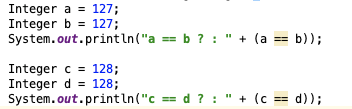
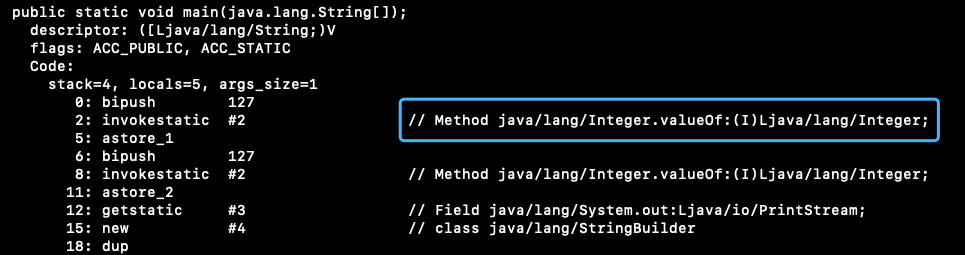
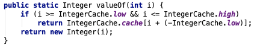
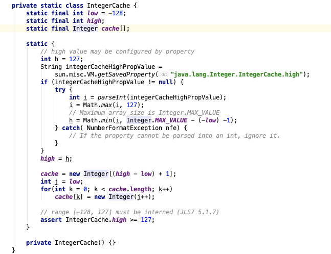

- 看到个很有意思的问题，
- 已知 Java 中除了基本类型 == 是比较地址，equals 比较值
- 那么下面这两个比较，哪个是 true，哪个是 false？
- 
- 如果按照上面的已知条件，结论应该都是 false，
- 但实际结果却是：
- 
- 查看这段代码对应的字节码，可以直到 Integer a = 127 实际执行的是：
- `Integer a = Integer.valueOf(127)`
- 
- 然后这个 valueOf 会判断，如果 Integer 范围在 -128~127 的范围则会从一个叫 IntegerCache.cache 的数组直接取数据
- 
- 可能是为了复用，Integer 中 -128~127 范围的数据在 JVM 初始化时被缓存起来
- 