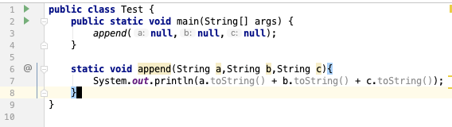
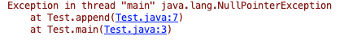
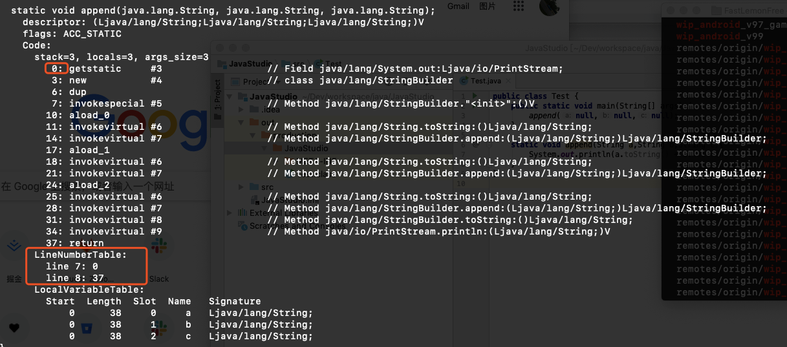
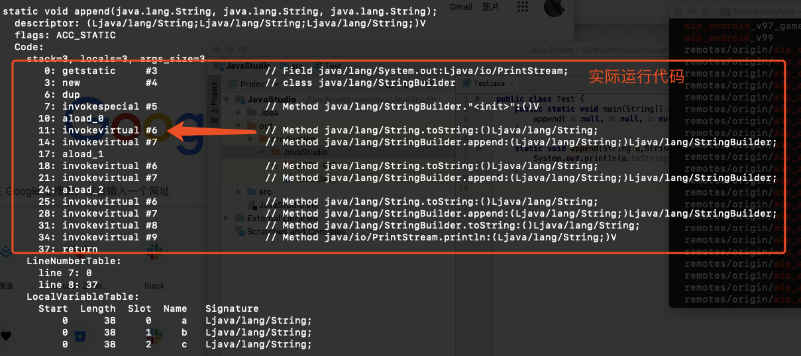

- Java 在报错信息只会提示代码的哪一行出错了，但是不会具体到哪一列
- 比如空指针，如果在一行写的比较长，你就不好确定具体哪个变量是空
- 比如这段代码，如果给 append 传三个 null 过去，第 7 行应该会报错，结果也和预期一样
- 
- 
- 它只会告诉你第 7 行空指针列，至于具体哪一个参数是空的，不好意思，你自己 debug 或者打日志去查
- 为什么报错不具体提示哪个对象或者哪一列是空指针呢？
- 反编译看一下它的字节码
- 
- 下面那个 LineNumberTable: 用来记录源码和字节码 `行` 的对应关系，
- 源码中的一行一般会对应字节码中的多行，所以需要用一个表来记录对应关系（这个功能不是必须的，对程序运行没有影响）
- 就像图中：
- `line 7: 0 line 8: 37` 的意思是，源码中的第 7 行对应上面的 `0:`，第 8 行 对应上面的 `37:`，一行源码编程成字节码直接干到 37 行
- 程序实际运行的是字节码，就是图中 Code: 部分代码
- 
- 结合源码我们知道是第一个 toString 由于对象为空导致空指针的，对应到字节码就是第 11 行报错
- 也就是说字节码知道具体哪个调用报错的，但是由于只记录的行的对应关系，没有列的对应关系，所以没法提示哪一列出错，但是好像有些虚拟机会把报错的命令抛出来（例如：Android ART），这里就会提示 String.toString() 空指针，但是在上面的 demo 中由于三个对象都调用列 toString()，所以还是无法定位到绝对位置
- 其实如果把字节码的行号给抛出来就可以定位到具体的错误位置，但是这么做可能坑更多吧，一直没有人这么做

> Android ART 文档里说当发生运行时异常时，ART 会提供尽可能多的上下文和详细信息：https://source.android.com/devices/tech/dalvik#Crash_Reports