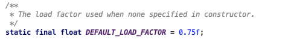
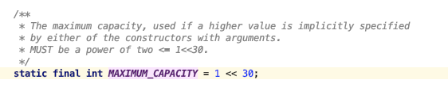
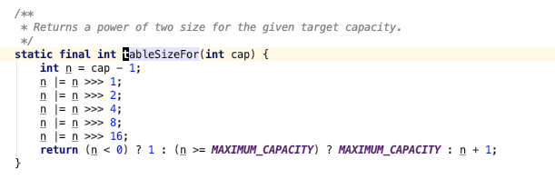
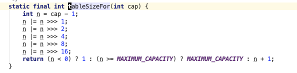

- 看到一篇文章讲一个面试题：用 HashMap 存 1 万条数据，构造时传 10000 还会触发扩容吗？
- 既然这么问了，肯定是不会触发扩容，要不然怎么能叫面试题呢
- 我们都知道 HashMap 的容量会动态变化，在存储快要满的时候会自动扩容，有一个 `factor` 控制扩容时机
- Java 里默认是 0.75，你也可以修改这个值：
- 
- 0.75 的意思是如果容量到达总容量的 75% 就会触发扩容，容量还有一个最大限制：
- 
- 那上面题目中初始传入 10000 的容量大小，存 1 万条数据显然已经超过 75%，按理会触发扩容
- 但是，问题就在这个容量有一条规则是：`MUST be a power of two`
- 也就是说你传入的初始容量 10000 会被调整为 2 的 N 次方
- 
- 通过上面这个方法计算得到的最接近 10000 的 2 的 N 次方的值是：16384
- 16384 * 0.75 = 12288，所以只有超过 12288 才会触发 HashMap 扩容
- 为什么这么计算就是最近的 2 的 N 次方呢
- 计算一个最接近且大于数字 n 并且是 2 的整数倍的数字
- 
- `>>>` 这个运算符的意思是右移 1 位，空出来的位置补 0，`|=` 的意思是按位或
- 比如昨天说 10000 对应的是 16384
- 乍一看被很懵逼，为什么要右移个 1，2，4，8，16 位，（后一个数字是前面所有数字之和 + 1，这个有没有数学名字）
- 首先一个已知条件： 2^x 这个数字在二进制有个特征是：10000...000...0
- 把这个数字 - 1 就得到 0111111...111111...1，这样的数字，那就想办法构造这个数字
- 其实原理很简单，就只要关心第一位 1 的位置变化就可以了，举个简单的例子，挑一个最简单的数字：128
- `10000000 |= (10000000 >>> 1)`
- `11000000 |= (11000000 >>> 2)`
- `11110000 |= (11110000 >>> 4)`
- `11111111 |= (11111111)`
- 首先，只要是 > 0 的数字，二进制左边第一位肯定是 1，好像是废话
- `上面的数字就是(10000000)，`
- `然后向右移一位(01000000)并做或运算 = 11000000`
- `然后向右移两位(00110000)并做或运算 = 11110000`
- `然后向右移四位(00001111)并做或运算 = 11111111`
- 以此类推，最后再 +1 就得到 100000000，2^9
- 我能想到其他的计算这个数字的办法就是暴力计算了，不知道还有没有其他的算法