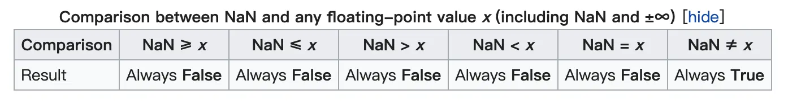

首先来看一段代码：
````
System.out.println("NaN equals NaN ? " + (Double.valueOf(Double.NaN).equals(Double.NaN)));

System.out.println("NaN >= NaN ? " + (Double.NaN >= Double.NaN));
System.out.println("NaN < NaN ? " + (Double.NaN < Double.NaN));
System.out.println("NaN != NaN ? " + (Double.NaN != Double.NaN));

System.out.println("NaN >= 0 ? " + (Double.NaN >= 0));
System.out.println("NaN < 0 ? " + (Double.NaN < 0));
System.out.println("NaN != 0 ? " + (Double.NaN != 0));
````

猜猜输出结果是什么？
````
NaN equals NaN ? true
NaN >= NaN ? false
NaN < NaN ? false
NaN != NaN ? true
NaN >= 0 ? false
NaN < 0 ? false
NaN != 0 ? true
````
是否和你想的一样？NaN 既不大于自己，也不小于自己，也不等于自己，同时它机不大于0也不小于0也不小于0，真是个奇葩的存在，那为什么会这样呢？其实这是 Java 或者很多语言的规范，它的规范来自：[IEEE_754](https://zh.wikipedia.org/wiki/IEEE_754)，总结就是，别拿它和数字进行比较，因为它根本不是数字（Not a Number）



更过分的是在 Java 里，想要判断一个数是否是 NaN，就是判断它是不是 != 自己。
````
public static boolean isNaN(double v) {
    return (v != v);
}
````

但是今天要说的不是这个，而是第一行代码，为什么 `NaN equals NaN = true` ?
Double.equals 的代码实现如下：
````
public boolean equals(Object obj) {
    return (obj instanceof Double)
               && (doubleToLongBits(((Double)obj).value) ==
                      doubleToLongBits(value));
}
````
它会先把 double 通过 doubleToLongBits 转换成 long，在进行比较，So Why？

直接比较两个 double 不就行了，为何要如此辛苦，先转成 long ，再比较大小呢，要想知道为什么，首先得知道 double 和 long 都是什么

浮点数对人来说还好理解，但是对计算机来说，真是太痛苦了，就像 N 个世纪之前，人们只知道有自然数，哪里知道有小数呢？ 就像几个世纪之前，人们只知道有自然数和小数，哪里知道有复数呢？甚至我们现在还不完全确定，数字是否还可以再拆分成更小的单位。

扯远了，言归正传，浮点数在计算机存储的格式如下：

其中：
 - sign：0表示正数，1表示负数
 - exponent：指数，2^n 次方，n 就是指数
 - fraction：尾数部分

什么意思呢？比如说有一个十进制的小数：123.45，它是一个普通的小数，我们也可以把它写成：1.2345 * 10^2，同理，如果一个二进制的数字：110.01，我们也可以写成：1.1001 * 2^2， 而这个时候，^2 就是 exponent 指数二次方，1.1001 就是尾数部分，而由于第一个数字总是1，所以通常忽略，所以写成 1001，此时，一个浮点数在计算机中的存储方式就变成：
 - `0 10 1001 `，我用空格隔开是为了区分 sign，exponent，fraction。

但是，这是我们人是灵活的，但是计算机可是很死板的，对于浮点数在计算机中的存储，一般是 32 位或者 64位，所以得规定 sign，exponent，fraction 各占几位，在 Java 中规定：
Float： 32位
 - sign：1位
 - exponent：8位
 - fraction：23位
Double：64位
 - sign：1位
 - exponent：11位
 - fraction：52位

所以上面的：110.01 在计算机中的存储方式如果是 float 应该是：
`0 00000010 00000000000000000001001`

但是，我们发现是不是漏了点啥？记得高中老师好像说过，指数可以是负数，但是我们这里没有体现呀？

标准制定者是这样设计的：让实际的指数 + 固定偏移， 固定偏移 = 2^(f - 1) - 1，f 是指数位宽 = 8，那在这儿固定位宽 = 2^7 - 1 = 127，这样做的好处是可以用一个正数表示所有的 - 126 ～ 127 范围内的指数（-127和128被用作特殊值处理，这里的特殊值就包括 NaN/无穷大/无穷小）。

所以终于可以给 110.01 这个二进制小数得出真实的在计算机中的存储了，它就是：
`0 10000001 00000000000000000001001`

终于松了一口气，我们看这个过程很复杂，怪不得 Java 在比较 double 的时候选择先转成 long，再比较（Java 也有专门用户毕竟 double 的指令，只不过在这里先转成 long）。

long 的存储就比较简单了，它就是直接把10进制转换为二进制再加一位符号位存起来，所以很简单。

到这里又想到一个问题
````
System.out.println("Max long < Max float ? " + (Long.MAX_VALUE < Float.MAX_VALUE));
````
这两个数字谁大？很不信的告诉你，Float.MAX_VALUE 更大，而且大很多，为什么呢？
明明 Float 只占 4 个字节，Long 占 8 个字节啊

其实这就是我们上面说到的，两种数据存储方式不一样导致的，Float 使用指数的方式存储数据，所以 32 的指数位宽为 8 ，所以它的范围为 - 2^(2^7 - 2) ~  2^(2^7 - 1) 次方，而 long 的存储方式是干巴巴的存储，所以它的范围为 - 2^63 ~ 2^63，所以 Float 的取值范围更大，而且大很多，但是 long 的精度更高，它可以表示 63 位精度的数字，而 Float 精度只有 23 + 1 位！

但是，既然 long 都没有 float 大，那为什么 double 还可以转成 long ？
原来，它指数把那 64 字节的数据按照 long 的格式读取出来了，也就是说读取出来的数字已经不是 double 所表示的实际大小了，生读啊。