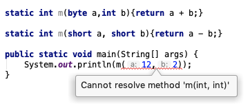

````
public static class A {}

public static class B extends A {}

public static void pp(A a){
    System.out.println("A");
}

public static void pp(B b){
    System.out.println("B");
}

public static void main(String[] args) {
    pp((A)new B());
}
````

上面这两个重载方法运行的时候遇到一个奇怪的现象：最终输出的是：A，而不是预期的 B，为啥呢？
按道理，B 才是实际类型，A 只是父类，为什么重载了`pp(A)` 呢？
查了一下资料发现，这个问题和 Java 方法重载的优先级有关

Java 规范定义了方法重载的优先级：
- 先匹配参数个数
- 参数类型的最佳匹配：直接所属类
- 如果没有找到直接所属类，会发生向上转型，直至找父类参数
- 如果向上转型仍无法匹配，则查找可变参数列表
- 以上无法匹配编译器报错

之所以设计成这样也好理解
- 具体调用哪个方法是在编译期决定的
- 方法参数的实际类型只有在运行时能确定
  所以编译器无法识别对象实际类型，总比直接报错强，所以就调用了形参的重载

下面这种重载编译器会直接报错，因为条件太模糊，编译器不确定具体调用哪个方法，或者说他们的优先级是一样的，但其实还可以多定义几个优先级就可以确定具体应该调用哪个方法
