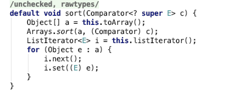
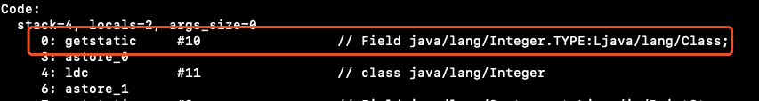
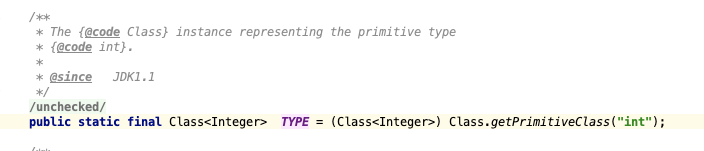
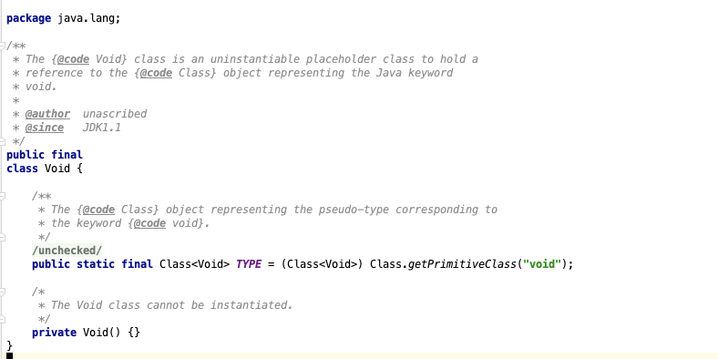

- ## Java 8 default method
- Java 8 中新增了 default method，就是可以给接口增加默认实现方法
- 由于接口支持多继承，所以这种做法其实变相实现了多继承
- 但是 default method 的设计目的不是为了实现多继承
- 而是为了给 Java 原来的 Api 提供一些默认实现，比如：
- java.utils.List<T> 是一个列表接口，Java 8 之前它没有任何的实现
- 如果你想要给数组排序，只能调用其他的工具类实现
- 但是在 Java 8 中就给它新增了一个 sort 接口
- 
- 这个 default method 和普通方法一样也可以被重写


- ## Java If 语句的一个隐藏功能
- Java 的 if 语句，如果判断条件确定为 false，那么再编译的时候这个 if 会被编译器扔掉，如果确定为 true，则会去掉判断条件，直接运行条件内部代码
- 比如这种代码：
  ````
  final bool condition = false;
  if(condition){
      System.out.println("i am deleted"å);
  }
  ````
- 在编译后下面的代码都被删了，这个规定只限于 if 语句，while/for 不会删掉
- 有什么用呢？
- 比如在项目里有些功能只在开发时候使用，你就可以定义一个全局的开关，然后这些功能都写在 if 语句中，在上线的时候把开关设置为 false，这部分代码就会被忽略


- ## 补充一下 Java Class 相关
- int.class 和 Integer.class 不是同一个对象
- 看了一下字节码 int.class 对应的是：
- 
- Integer.TYPE，是一个静态属性
- 
- 注意这里的 Class 不是通过常规的 ClassLoader 加载类生成的，而是通过一个叫：
- `static native Class<?> getPrimitiveClass(String name);`
- 这个 Native 方法生成的
- JVM的实现中，在JVM初始化的时候就会把原始类型和void对应的Class对象创建出来。这些Class对象的创建不依赖任何外部信息（例如说需要从Class文件加载的信息），不需要经历类加载过程，而纯粹是JVM的实现细节。
- void 也有对应的 Class，这些都是为了反射方便
- 

- ## Java 基类和它们的包装类
- 关于 Java 为什么不直接用包装类替换基本类型
- 1.基本类型不存在 null，一旦初始化 JVM 就会给其出生值，而包装类初始化时值为 null
- 2.基本类型比包装类轻量
```
Long sum = 0L; // uses Long, not long
for (long i = 0; i <= Integer.MAX_VALUE; i++) {
  sum += i;
}
```
- 上面这段代码测试耗时 6.765s，但是如果把 Long 换成 long 结果是 0.966s
- 因为如果使用 Long sum += i 的过程要不断的创建 Long 对象
- 3.基本类型可以直接用 == 比较大小
- 
- ## Java 信号量
- 之前做广告有个需求，要求多个广告 SDK 按顺序加载广告，最开始想的是通过 Java 提供的锁 Lock 控制，但是 Lock 的申请和释放必须在同一个线程，而下一个广告 SDK 要等这个 SDK 请求成功或者失败后才能加载，SDK 所在线程又不好控制，所以使用 Lock 不合适
- 后来查到 Java 提供一个信号量机制，感觉特别合适：Semaphore，它特别适合资源控制并发数量
- 比如你首先定好最大并发数量是 1：`Semaphore s = new Semaphore(1)`
  然后在第一个广告进入时调用 `s.acquire()` 申请到资源
- 如果资源不足就会阻塞等待，如果没有申请打就会阻塞，在广告成功或失败时调用 `s.release()` 释放资源，此时其他等待的线程就会再去竞争资源，申请和释放没有线程的限制非常适合当前使用场景