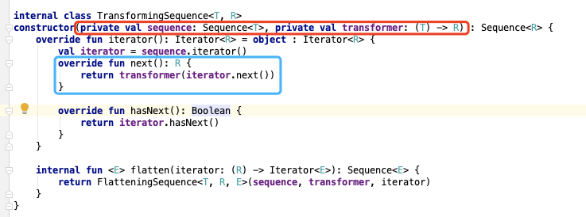

- Kotlin 提供了两组对列表进行流式处理的方法，一个是直接使用 Collections，一个是 Sequences
- 他们两的区别是：直接处理每一步操作都会马上进行处理，Sequences 只有最后一步调用后开始处理，俗称懒处理
- 比如一个 list，
- `val numbers = listOf(1, 2, 3, 4, 5, 6, 7, 8, 9)`
- 直接处理的话，每一步都会将结果存储在一个新的 list 中以供下一步使用
```
val sum1 = numbers
        .filter { it % 2 == 0 }
        .map { it.toString() }
        .map { it.toInt() }
        .sumBy { it }
```
- Sequences 只会在最后一步开始处理
```
val sum2 = numbers
        .asSequence()
        .filter { it % 2 == 0 }
        .map { it.toString() }
        .map { it.toInt() }
        .sumBy { it }
```
- 实现原理是：Sequences 会将之前的每一步操作记录为一个 Sequence，大概类似这样的
- `Sequence $this$sumBy$iv = SequencesKt.map(SequencesKt.map(SequencesKt.filter(CollectionsKt.asSequence((Iterable)numbers), (Function1)null.INSTANCE), (Function1)null.INSTANCE), (Function1)null.INSTANCE);`
- 每个 Sequence 的构造函数都会传入上一个 Sequence 和对应的 处理函数
- 比如 map 操作对应的 Sequence
- 
- 每个 Sequence 有一个 next 方法，首先会调上一个 Sequence 的 next 并获取返回值
- 然后在调它自己的 处理函数 最后再把结果返回
- 优缺点：
- Sequence 的优点是，只循环一次，避免中间生成 list 浪费内存，适合大列表，但是方法调用比较多
- Collections 使用内联函数，方法调用少，但是内存占用较多，适合数据少的时候