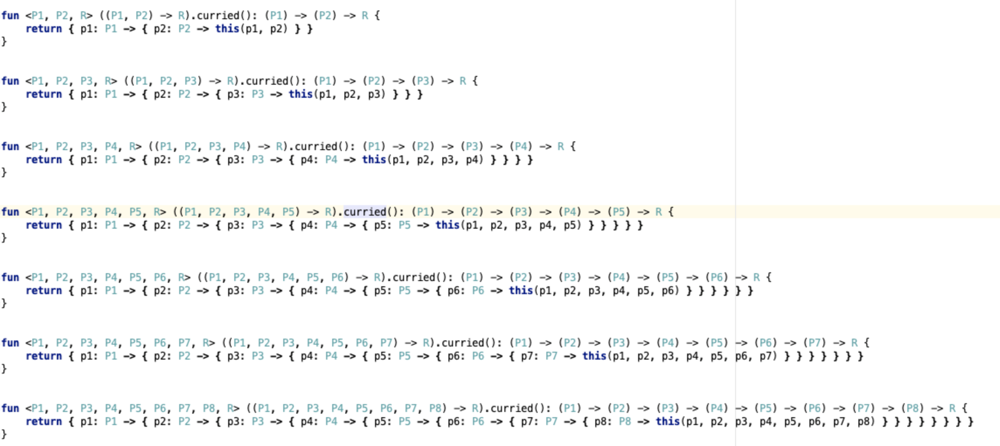

> 在计算机科学中，柯里化（英语：Currying），又译为卡瑞化或加里化，是把接受多个参数的函数变换成接受一个单一参数（最初函数的第一个参数）的函数，并且返回接受余下的参数而且返回结果的新函数的技术。这个技术由克里斯托弗·斯特雷奇以逻辑学家哈斯凯尔·加里命名的，尽管它是Moses Schönfinkel和戈特洛布·弗雷格发明的。

看到 Js 的一篇讲给函数柯里化的文章，既然 Js 支持，那么 Kotlin 里函数也是一等公民，应该也支持柯里化，但是遗憾的是官方并没有支持，面向 Google 编程了一会，找到了一个第三方的库实现了这个功能

首先什么是柯里化，比如下面这段代码：
````
val add = { a: Int, b: Int, c: Int, d: Int, e: Int -> println("${a + b + c + d + e}") }
````
正常调用是酱紫的：
````
add(1,2,3,4,5)
````
柯里化就是让这个传参的过程可以分步进行，每次只传一个参数，本质是把一个方法拆成多个方法执行：
````
add(1)(2)(3)(4)(5)
````
至于有什么用，举个栗子🌰
````
add(1)(2)(3)(4)(5)
add(1)(2)(3)(4)(6)
add(1)(2)(3)(4)(7)
add(1)(2)(3)(4)(8)
````
上面这个调用每次只有最后一个参数有变化，前面4个参数都是固定的，如果直接这样写看起来很丑，而柯里化可以这样：
````
val addCurried = add.curried()
val addE = addCurried(1)(2)(3)(4)
addE(5)
addE(6)
addE(7)
addE(8)
````
那个第三方库是怎么实现柯里化的呢？看了一下源码，简单的吓人：


它给 2-22 个参数长度的方法增加了扩展方法 `curried()`（kotlin 支持给类型或者方法添加扩展方法），然后利用多态，根据参数长度自动选择对应的方法，而方法的实现就是一堆嵌套的 lambda 函数。
那如果超过 22 个参数的方法怎么办呢？对不起，这个库不支持超过22个参数方法的柯里化，不过你可以自己加扩展方法，想加多少加多少

第三方库：implementation "org.funktionale:funktionale-currying:1.2"
参考：[Curried Kotlin](https://medium.com/@przemek.materna/curried-kotlin-48166885ddfa)