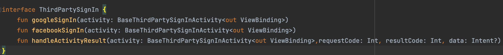
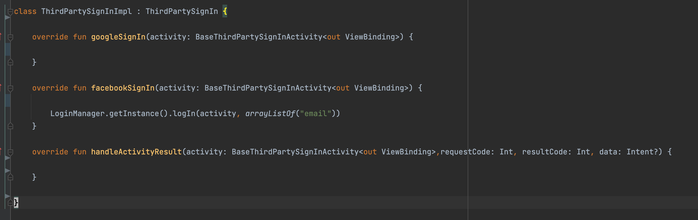
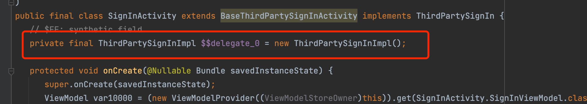
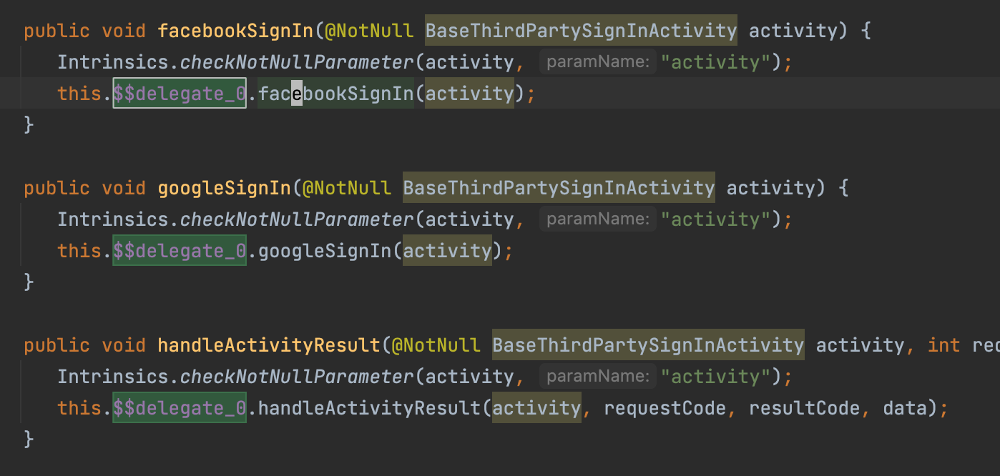

- Kotlin 的委托机制
- 做第三方登陆的时候，由于有好几个页面都要用到 Google/Facebook 登陆，为了方便服用使用了 Kotlin 的委托机制
- Kotlin 和 Java 一样不允许多继承累，但是可以多继承接口，委托机制就是利用了这个特性
- 首先定一个接口：
- 
- 再去实现这个接口，具体实现内容就不放了
- 
- 然后在需要用到第三方登陆的地方继承一下这个接口
- 
- by 后面是具体的实现接口的类
- 这样就可以在这个类内部使用委托的方法了，就像是这个类自己的方法一样
- 
- 实现原理也很简单，编译器在编译的时候偷偷 new 了一个实现类
- 
- 然后在重载的方法里调具体的实现
- 