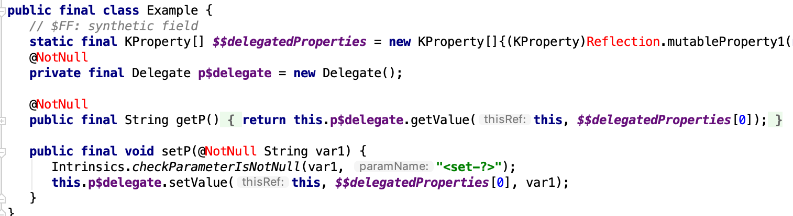

- Kotlin 属性代理（Delegated Properties）可以让你给某个属性添加一个代理
```
class Example {
    var p:String by Delegate()
}
```
- `var p:String by Delegate()` 这句中 `Delegate` 就是那个代理，它必须实现下面的方法
- 如果被代理的是一个不可变的属性 `val p` 就要实现 `getValue` 方法
- `override operator fun getValue(thisRef:Example, property:KProperty<*>):String{}`
- 如果 `p` 是可变的，还需要实现 `setValue` 方法
- `override operator fun setValue(thisRef: Example, property: KProperty<*>, value:String){}`
- 其中 `thisRef` 指的是 `Example` 类，`property` 代表 `p` 本身，`value` 是要给设置的新值
- 怎么理解这个呢，其实 `p` 在编译后就不再是一个属性了，而是变成这样
- 
- 本质上就是个语法糖，常用的 `val p by lazy {}` 这种写法就是一个属性代理