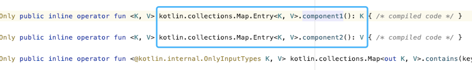

- Kotlin 也支持 解构申明(destructuring declaration) 的语法，比如
```
data class Test(val a:Int,val b:Int)
val test = Test(1,2)
val (p1,p2) = test
```
- (p1,p2) 就会自动取 Test 的两个成员变量的值，也可以前几个，但是必须按照顺序写
- 用法的话，比如一个方法返回 Test，我只想取其中的一个值，这样就可以直接用了
```
fun getTest():Test
val (p1) = getTest()
```
- 再就是 for 循环中比如遍历一个 map 可以这样
- `for((key,value) in map)`
- 实现方式是约定一个 componentN 的方法，N 代表第几个值
- data class，不需要手动去写，因为会自动生成 componentN 方法，你也可以自己实现
```
class Test(val a:Int,val b:Int) {
    operator fun component1(): Int {
        return a
    }
    operator fun component2(): Int {
        return b
    }
}
```
- Map 通过扩展方法实现了这个方法
- 
- 集合也支持这种写法，但是默认只写了前五个元素的
```
val arr = listOf(1,2,3,4,5)
val (a,b,c,d,e) = arr
```